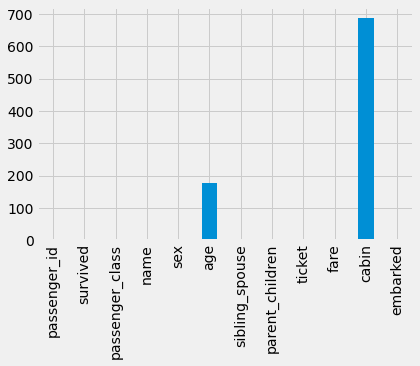

# Introduction

The sinking of the Titanic is one of the most infamous shipwrecks in history.

On April 15, 1912, during her maiden voyage, the widely considered “unsinkable” RMS Titanic sank after colliding with an iceberg. Unfortunately, there weren’t enough lifeboats for everyone onboard, resulting in the death of 1502 out of 2224 passengers and crew.

While there was some element of luck involved in surviving, it seems some groups of people were more likely to survive than others.

In this challenge, we ask you to build a predictive model that answers the question: “what sorts of people were more likely to survive?” using passenger data (ie name, age, gender, socio-economic class, etc).


# Data Description

The training set should be used to build your machine learning models. For the training set, we provide the outcome (also known as the “ground truth”) for each passenger. Your model will be based on “features” like passengers’ gender and class. You can also use feature engineering to create new features.

The test set should be used to see how well your model performs on unseen data. For the test set, we do not provide the ground truth for each passenger. It is your job to predict these outcomes. For each passenger in the test set, use the model you trained to predict whether or not they survived the sinking of the Titanic.

We also include gender_submission.csv, a set of predictions that assume all and only female passengers survive, as an example of what a submission file should look like.


Variable Notes
pclass: A proxy for socio-economic status (SES)
1st = Upper
2nd = Middle
3rd = Lower

age: Age is fractional if less than 1. If the age is estimated, is it in the form of xx.5

sibsp: The dataset defines family relations in this way...

Sibling = brother, sister, stepbrother, stepsister

Spouse = husband, wife (mistresses and fiancés were ignored)

parch: The dataset defines family relations in this way...

Parent = mother, father

Child = daughter, son, stepdaughter, stepson

Some children travelled only with a nanny, therefore parch=0 for them.


Variable	Definition	Key
survival	Survival	0 = No, 1 = Yes
pclass	Ticket class	1 = 1st, 2 = 2nd, 3 = 3rd
sex	Sex	
Age	Age in years	
sibsp	# of siblings / spouses aboard the Titanic	
parch	# of parents / children aboard the Titanic	
ticket	Ticket number	
fare	Passenger fare	
cabin	Cabin number	
embarked	Port of Embarkation	C = Cherbourg, Q = Queenstown, S = Southampton

# Loading Libraries


```python
import pandas as pd #For Data Analysis
import numpy as np # For numerical Computations
import matplotlib.pyplot as plt # For Visualization
import seaborn as sns # For Visualization
import re # For Capturing words
plt.style.use('fivethirtyeight')
```

# Loading Datasets


```python
train_df = pd.read_csv('../data/train.csv')
test_df = pd.read_csv('../data/test.csv')
```

# Data Information and data types


```python
# Checking the Datatypes of the columns
train_df.info()
```

    <class 'pandas.core.frame.DataFrame'>
    RangeIndex: 891 entries, 0 to 890
    Data columns (total 12 columns):
     #   Column       Non-Null Count  Dtype  
    ---  ------       --------------  -----  
     0   PassengerId  891 non-null    int64  
     1   Survived     891 non-null    int64  
     2   Pclass       891 non-null    int64  
     3   Name         891 non-null    object 
     4   Sex          891 non-null    object 
     5   Age          714 non-null    float64
     6   SibSp        891 non-null    int64  
     7   Parch        891 non-null    int64  
     8   Ticket       891 non-null    object 
     9   Fare         891 non-null    float64
     10  Cabin        204 non-null    object 
     11  Embarked     889 non-null    object 
    dtypes: float64(2), int64(5), object(5)
    memory usage: 83.7+ KB


```python
test_df.info()
```

    <class 'pandas.core.frame.DataFrame'>
    RangeIndex: 418 entries, 0 to 417
    Data columns (total 11 columns):
     #   Column       Non-Null Count  Dtype  
    ---  ------       --------------  -----  
     0   PassengerId  418 non-null    int64  
     1   Pclass       418 non-null    int64  
     2   Name         418 non-null    object 
     3   Sex          418 non-null    object 
     4   Age          332 non-null    float64
     5   SibSp        418 non-null    int64  
     6   Parch        418 non-null    int64  
     7   Ticket       418 non-null    object 
     8   Fare         417 non-null    float64
     9   Cabin        91 non-null     object 
     10  Embarked     418 non-null    object 
    dtypes: float64(2), int64(4), object(5)
    memory usage: 36.0+ KB


# EDA of training data

## 1. Renaming columns


```python
train_df.head()
```


<div>
<style scoped>
    .dataframe tbody tr th:only-of-type {
        vertical-align: middle;
    }

    .dataframe tbody tr th {
        vertical-align: top;
    }

    .dataframe thead th {
        text-align: right;
    }
</style>
<table border="1" class="dataframe">
  <thead>
    <tr style="text-align: right;">
      <th></th>
      <th>PassengerId</th>
      <th>Survived</th>
      <th>Pclass</th>
      <th>Name</th>
      <th>Sex</th>
      <th>Age</th>
      <th>SibSp</th>
      <th>Parch</th>
      <th>Ticket</th>
      <th>Fare</th>
      <th>Cabin</th>
      <th>Embarked</th>
    </tr>
  </thead>
  <tbody>
    <tr>
      <th>0</th>
      <td>1</td>
      <td>0</td>
      <td>3</td>
      <td>Braund, Mr. Owen Harris</td>
      <td>male</td>
      <td>22.0</td>
      <td>1</td>
      <td>0</td>
      <td>A/5 21171</td>
      <td>7.2500</td>
      <td>NaN</td>
      <td>S</td>
    </tr>
    <tr>
      <th>1</th>
      <td>2</td>
      <td>1</td>
      <td>1</td>
      <td>Cumings, Mrs. John Bradley (Florence Briggs Th...</td>
      <td>female</td>
      <td>38.0</td>
      <td>1</td>
      <td>0</td>
      <td>PC 17599</td>
      <td>71.2833</td>
      <td>C85</td>
      <td>C</td>
    </tr>
    <tr>
      <th>2</th>
      <td>3</td>
      <td>1</td>
      <td>3</td>
      <td>Heikkinen, Miss. Laina</td>
      <td>female</td>
      <td>26.0</td>
      <td>0</td>
      <td>0</td>
      <td>STON/O2. 3101282</td>
      <td>7.9250</td>
      <td>NaN</td>
      <td>S</td>
    </tr>
    <tr>
      <th>3</th>
      <td>4</td>
      <td>1</td>
      <td>1</td>
      <td>Futrelle, Mrs. Jacques Heath (Lily May Peel)</td>
      <td>female</td>
      <td>35.0</td>
      <td>1</td>
      <td>0</td>
      <td>113803</td>
      <td>53.1000</td>
      <td>C123</td>
      <td>S</td>
    </tr>
    <tr>
      <th>4</th>
      <td>5</td>
      <td>0</td>
      <td>3</td>
      <td>Allen, Mr. William Henry</td>
      <td>male</td>
      <td>35.0</td>
      <td>0</td>
      <td>0</td>
      <td>373450</td>
      <td>8.0500</td>
      <td>NaN</td>
      <td>S</td>
    </tr>
  </tbody>
</table>
</div>


```python
# Converting the column names to lower_case and replacing some headings
train_df.columns = [x.lower() for x in train_df.columns]
train_df.columns
```


    Index(['passengerid', 'survived', 'pclass', 'name', 'sex', 'age', 'sibsp',
           'parch', 'ticket', 'fare', 'cabin', 'embarked'],
          dtype='object')


```python
# Doing the same for test_df
test_df.columns = [x.lower() for x in test_df.columns]
```


```python
train_df.rename(columns={
            "passengerid":"passenger_id",
            "pclass":"passenger_class",
            "sibsp":"sibling_spouse",
            "parch":"parent_children"
        }, inplace=True)
```


```python
# Doing the same for train df
test_df.rename(columns={
            "passengerid":"passenger_id",
            "pclass":"passenger_class",
            "sibsp":"sibling_spouse",
            "parch":"parent_children"
        }, inplace=True)
```


```python
train_df.head()
```


<div>
<style scoped>
    .dataframe tbody tr th:only-of-type {
        vertical-align: middle;
    }

    .dataframe tbody tr th {
        vertical-align: top;
    }

    .dataframe thead th {
        text-align: right;
    }
</style>
<table border="1" class="dataframe">
  <thead>
    <tr style="text-align: right;">
      <th></th>
      <th>passenger_id</th>
      <th>survived</th>
      <th>passenger_class</th>
      <th>name</th>
      <th>sex</th>
      <th>age</th>
      <th>sibling_spouse</th>
      <th>parent_children</th>
      <th>ticket</th>
      <th>fare</th>
      <th>cabin</th>
      <th>embarked</th>
    </tr>
  </thead>
  <tbody>
    <tr>
      <th>0</th>
      <td>1</td>
      <td>0</td>
      <td>3</td>
      <td>Braund, Mr. Owen Harris</td>
      <td>male</td>
      <td>22.0</td>
      <td>1</td>
      <td>0</td>
      <td>A/5 21171</td>
      <td>7.2500</td>
      <td>NaN</td>
      <td>S</td>
    </tr>
    <tr>
      <th>1</th>
      <td>2</td>
      <td>1</td>
      <td>1</td>
      <td>Cumings, Mrs. John Bradley (Florence Briggs Th...</td>
      <td>female</td>
      <td>38.0</td>
      <td>1</td>
      <td>0</td>
      <td>PC 17599</td>
      <td>71.2833</td>
      <td>C85</td>
      <td>C</td>
    </tr>
    <tr>
      <th>2</th>
      <td>3</td>
      <td>1</td>
      <td>3</td>
      <td>Heikkinen, Miss. Laina</td>
      <td>female</td>
      <td>26.0</td>
      <td>0</td>
      <td>0</td>
      <td>STON/O2. 3101282</td>
      <td>7.9250</td>
      <td>NaN</td>
      <td>S</td>
    </tr>
    <tr>
      <th>3</th>
      <td>4</td>
      <td>1</td>
      <td>1</td>
      <td>Futrelle, Mrs. Jacques Heath (Lily May Peel)</td>
      <td>female</td>
      <td>35.0</td>
      <td>1</td>
      <td>0</td>
      <td>113803</td>
      <td>53.1000</td>
      <td>C123</td>
      <td>S</td>
    </tr>
    <tr>
      <th>4</th>
      <td>5</td>
      <td>0</td>
      <td>3</td>
      <td>Allen, Mr. William Henry</td>
      <td>male</td>
      <td>35.0</td>
      <td>0</td>
      <td>0</td>
      <td>373450</td>
      <td>8.0500</td>
      <td>NaN</td>
      <td>S</td>
    </tr>
  </tbody>
</table>
</div>


## 2. Finding Missing Values


```python
train_df.isnull().sum()
```


    passenger_id         0
    survived             0
    passenger_class      0
    name                 0
    sex                  0
    age                177
    sibling_spouse       0
    parent_children      0
    ticket               0
    fare                 0
    cabin              687
    embarked             2
    dtype: int64


```python
train_df.isnull().sum().plot(kind='bar')
```


    <AxesSubplot:>


    

    


```python
# Pictorial
sns.heatmap(train_df.isnull(), cbar=False)

```


    <AxesSubplot:>


    

    


#### Inference (finding missing values): 
From the above plots we can see, that Columns Age, Cabin, Embarked are missing some values. Going further we can see how we can rectify them

## 3. Checking Each Column values and Feature Engineering

### 1. Passenger Id


```python
train_df[["passenger_id"]]
```


<div>
<style scoped>
    .dataframe tbody tr th:only-of-type {
        vertical-align: middle;
    }

    .dataframe tbody tr th {
        vertical-align: top;
    }

    .dataframe thead th {
        text-align: right;
    }
</style>
<table border="1" class="dataframe">
  <thead>
    <tr style="text-align: right;">
      <th></th>
      <th>passenger_id</th>
    </tr>
  </thead>
  <tbody>
    <tr>
      <th>0</th>
      <td>1</td>
    </tr>
    <tr>
      <th>1</th>
      <td>2</td>
    </tr>
    <tr>
      <th>2</th>
      <td>3</td>
    </tr>
    <tr>
      <th>3</th>
      <td>4</td>
    </tr>
    <tr>
      <th>4</th>
      <td>5</td>
    </tr>
    <tr>
      <th>...</th>
      <td>...</td>
    </tr>
    <tr>
      <th>886</th>
      <td>887</td>
    </tr>
    <tr>
      <th>887</th>
      <td>888</td>
    </tr>
    <tr>
      <th>888</th>
      <td>889</td>
    </tr>
    <tr>
      <th>889</th>
      <td>890</td>
    </tr>
    <tr>
      <th>890</th>
      <td>891</td>
    </tr>
  </tbody>
</table>
<p>891 rows × 1 columns</p>
</div>


```python
plt.figure(figsize=(12,5))
g = sns.FacetGrid(train_df, col='survived',size=5)
g = g.map(sns.distplot, "passenger_id")
plt.show()
```

    /home/iamsyedjafer/.local/lib/python3.8/site-packages/seaborn/axisgrid.py:337: UserWarning: The `size` parameter has been renamed to `height`; please update your code.
      warnings.warn(msg, UserWarning)
    /home/iamsyedjafer/.local/lib/python3.8/site-packages/seaborn/distributions.py:2619: FutureWarning: `distplot` is a deprecated function and will be removed in a future version. Please adapt your code to use either `displot` (a figure-level function with similar flexibility) or `histplot` (an axes-level function for histograms).
      warnings.warn(msg, FutureWarning)
    /home/iamsyedjafer/.local/lib/python3.8/site-packages/seaborn/distributions.py:2619: FutureWarning: `distplot` is a deprecated function and will be removed in a future version. Please adapt your code to use either `displot` (a figure-level function with similar flexibility) or `histplot` (an axes-level function for histograms).
      warnings.warn(msg, FutureWarning)


    <Figure size 864x360 with 0 Axes>


    

    


#### Inference: 
Since passenger_id column is an index column, and it has no relation with survival rate, we can ignore the passenger_id column

### 2. Passenger Class


```python
train_df.passenger_class.unique()
```


    array([3, 1, 2])


#### Distribution of passenger class


```python
train_df.passenger_class.value_counts().plot(kind='pie')
```


    <AxesSubplot:ylabel='passenger_class'>


    

    


```python
train_df.passenger_class.value_counts().plot(kind='bar')
```


    <AxesSubplot:>


    

    


#### Comparison of P Class with survival


```python
plt.figure(figsize=(12,5))
sns.countplot("passenger_class", data=train_df, hue="survived", palette="hls")
plt.ylabel("Count", fontsize=18)
plt.xlabel("P Class", fontsize=18)
plt.title("P Class Distribution ", fontsize=20)
```

    /home/iamsyedjafer/.local/lib/python3.8/site-packages/seaborn/_decorators.py:36: FutureWarning: Pass the following variable as a keyword arg: x. From version 0.12, the only valid positional argument will be `data`, and passing other arguments without an explicit keyword will result in an error or misinterpretation.
      warnings.warn(


    Text(0.5, 1.0, 'P Class Distribution ')


    

    


From the above plot, we can see Passengers in Class 1 and 2 were having good survival rate than Passenger in class 3


```python
train_df.groupby("passenger_class").survived.value_counts(normalize=True).sort_index()
```


    passenger_class  survived
    1                0           0.370370
                     1           0.629630
    2                0           0.527174
                     1           0.472826
    3                0           0.757637
                     1           0.242363
    Name: survived, dtype: float64


#### Inference (passenger_class):
From the above normalized data, we can understand that people in class 1 had 63 % survival rate and class 2 is having 47 % survival rate. 

### 3. Name column


```python
train_df.name.unique()
```


    array(['Braund, Mr. Owen Harris',
           'Cumings, Mrs. John Bradley (Florence Briggs Thayer)',
           'Heikkinen, Miss. Laina',
           'Futrelle, Mrs. Jacques Heath (Lily May Peel)',
           'Allen, Mr. William Henry', 'Moran, Mr. James',
           'McCarthy, Mr. Timothy J', 'Palsson, Master. Gosta Leonard',
           'Johnson, Mrs. Oscar W (Elisabeth Vilhelmina Berg)',
           'Nasser, Mrs. Nicholas (Adele Achem)',
           'Sandstrom, Miss. Marguerite Rut', 'Bonnell, Miss. Elizabeth',
           'Saundercock, Mr. William Henry', 'Andersson, Mr. Anders Johan',
           'Vestrom, Miss. Hulda Amanda Adolfina',
           'Hewlett, Mrs. (Mary D Kingcome) ', 'Rice, Master. Eugene',
           'Williams, Mr. Charles Eugene',
           'Vander Planke, Mrs. Julius (Emelia Maria Vandemoortele)',
           'Masselmani, Mrs. Fatima', 'Fynney, Mr. Joseph J',
           'Beesley, Mr. Lawrence', 'McGowan, Miss. Anna "Annie"',
           'Sloper, Mr. William Thompson', 'Palsson, Miss. Torborg Danira',
           'Asplund, Mrs. Carl Oscar (Selma Augusta Emilia Johansson)',
           'Emir, Mr. Farred Chehab', 'Fortune, Mr. Charles Alexander',
           'O\'Dwyer, Miss. Ellen "Nellie"', 'Todoroff, Mr. Lalio',
           'Uruchurtu, Don. Manuel E',
           'Spencer, Mrs. William Augustus (Marie Eugenie)',
           'Glynn, Miss. Mary Agatha', 'Wheadon, Mr. Edward H',
           'Meyer, Mr. Edgar Joseph', 'Holverson, Mr. Alexander Oskar',
           'Mamee, Mr. Hanna', 'Cann, Mr. Ernest Charles',
           'Vander Planke, Miss. Augusta Maria',
           'Nicola-Yarred, Miss. Jamila',
           'Ahlin, Mrs. Johan (Johanna Persdotter Larsson)',
           'Turpin, Mrs. William John Robert (Dorothy Ann Wonnacott)',
           'Kraeff, Mr. Theodor', 'Laroche, Miss. Simonne Marie Anne Andree',
           'Devaney, Miss. Margaret Delia', 'Rogers, Mr. William John',
           'Lennon, Mr. Denis', "O'Driscoll, Miss. Bridget",
           'Samaan, Mr. Youssef',
           'Arnold-Franchi, Mrs. Josef (Josefine Franchi)',
           'Panula, Master. Juha Niilo', 'Nosworthy, Mr. Richard Cater',
           'Harper, Mrs. Henry Sleeper (Myna Haxtun)',
           'Faunthorpe, Mrs. Lizzie (Elizabeth Anne Wilkinson)',
           'Ostby, Mr. Engelhart Cornelius', 'Woolner, Mr. Hugh',
           'Rugg, Miss. Emily', 'Novel, Mr. Mansouer',
           'West, Miss. Constance Mirium',
           'Goodwin, Master. William Frederick', 'Sirayanian, Mr. Orsen',
           'Icard, Miss. Amelie', 'Harris, Mr. Henry Birkhardt',
           'Skoog, Master. Harald', 'Stewart, Mr. Albert A',
           'Moubarek, Master. Gerios', 'Nye, Mrs. (Elizabeth Ramell)',
           'Crease, Mr. Ernest James', 'Andersson, Miss. Erna Alexandra',
           'Kink, Mr. Vincenz', 'Jenkin, Mr. Stephen Curnow',
           'Goodwin, Miss. Lillian Amy', 'Hood, Mr. Ambrose Jr',
           'Chronopoulos, Mr. Apostolos', 'Bing, Mr. Lee',
           'Moen, Mr. Sigurd Hansen', 'Staneff, Mr. Ivan',
           'Moutal, Mr. Rahamin Haim', 'Caldwell, Master. Alden Gates',
           'Dowdell, Miss. Elizabeth', 'Waelens, Mr. Achille',
           'Sheerlinck, Mr. Jan Baptist', 'McDermott, Miss. Brigdet Delia',
           'Carrau, Mr. Francisco M', 'Ilett, Miss. Bertha',
           'Backstrom, Mrs. Karl Alfred (Maria Mathilda Gustafsson)',
           'Ford, Mr. William Neal', 'Slocovski, Mr. Selman Francis',
           'Fortune, Miss. Mabel Helen', 'Celotti, Mr. Francesco',
           'Christmann, Mr. Emil', 'Andreasson, Mr. Paul Edvin',
           'Chaffee, Mr. Herbert Fuller', 'Dean, Mr. Bertram Frank',
           'Coxon, Mr. Daniel', 'Shorney, Mr. Charles Joseph',
           'Goldschmidt, Mr. George B', 'Greenfield, Mr. William Bertram',
           'Doling, Mrs. John T (Ada Julia Bone)', 'Kantor, Mr. Sinai',
           'Petranec, Miss. Matilda', 'Petroff, Mr. Pastcho ("Pentcho")',
           'White, Mr. Richard Frasar', 'Johansson, Mr. Gustaf Joel',
           'Gustafsson, Mr. Anders Vilhelm', 'Mionoff, Mr. Stoytcho',
           'Salkjelsvik, Miss. Anna Kristine', 'Moss, Mr. Albert Johan',
           'Rekic, Mr. Tido', 'Moran, Miss. Bertha',
           'Porter, Mr. Walter Chamberlain', 'Zabour, Miss. Hileni',
           'Barton, Mr. David John', 'Jussila, Miss. Katriina',
           'Attalah, Miss. Malake', 'Pekoniemi, Mr. Edvard',
           'Connors, Mr. Patrick', 'Turpin, Mr. William John Robert',
           'Baxter, Mr. Quigg Edmond', 'Andersson, Miss. Ellis Anna Maria',
           'Hickman, Mr. Stanley George', 'Moore, Mr. Leonard Charles',
           'Nasser, Mr. Nicholas', 'Webber, Miss. Susan',
           'White, Mr. Percival Wayland', 'Nicola-Yarred, Master. Elias',
           'McMahon, Mr. Martin', 'Madsen, Mr. Fridtjof Arne',
           'Peter, Miss. Anna', 'Ekstrom, Mr. Johan', 'Drazenoic, Mr. Jozef',
           'Coelho, Mr. Domingos Fernandeo',
           'Robins, Mrs. Alexander A (Grace Charity Laury)',
           'Weisz, Mrs. Leopold (Mathilde Francoise Pede)',
           'Sobey, Mr. Samuel James Hayden', 'Richard, Mr. Emile',
           'Newsom, Miss. Helen Monypeny', 'Futrelle, Mr. Jacques Heath',
           'Osen, Mr. Olaf Elon', 'Giglio, Mr. Victor',
           'Boulos, Mrs. Joseph (Sultana)', 'Nysten, Miss. Anna Sofia',
           'Hakkarainen, Mrs. Pekka Pietari (Elin Matilda Dolck)',
           'Burke, Mr. Jeremiah', 'Andrew, Mr. Edgardo Samuel',
           'Nicholls, Mr. Joseph Charles',
           'Andersson, Mr. August Edvard ("Wennerstrom")',
           'Ford, Miss. Robina Maggie "Ruby"',
           'Navratil, Mr. Michel ("Louis M Hoffman")',
           'Byles, Rev. Thomas Roussel Davids', 'Bateman, Rev. Robert James',
           'Pears, Mrs. Thomas (Edith Wearne)', 'Meo, Mr. Alfonzo',
           'van Billiard, Mr. Austin Blyler', 'Olsen, Mr. Ole Martin',
           'Williams, Mr. Charles Duane', 'Gilnagh, Miss. Katherine "Katie"',
           'Corn, Mr. Harry', 'Smiljanic, Mr. Mile',
           'Sage, Master. Thomas Henry', 'Cribb, Mr. John Hatfield',
           'Watt, Mrs. James (Elizabeth "Bessie" Inglis Milne)',
           'Bengtsson, Mr. John Viktor', 'Calic, Mr. Jovo',
           'Panula, Master. Eino Viljami',
           'Goldsmith, Master. Frank John William "Frankie"',
           'Chibnall, Mrs. (Edith Martha Bowerman)',
           'Skoog, Mrs. William (Anna Bernhardina Karlsson)',
           'Baumann, Mr. John D', 'Ling, Mr. Lee',
           'Van der hoef, Mr. Wyckoff', 'Rice, Master. Arthur',
           'Johnson, Miss. Eleanor Ileen', 'Sivola, Mr. Antti Wilhelm',
           'Smith, Mr. James Clinch', 'Klasen, Mr. Klas Albin',
           'Lefebre, Master. Henry Forbes', 'Isham, Miss. Ann Elizabeth',
           'Hale, Mr. Reginald', 'Leonard, Mr. Lionel',
           'Sage, Miss. Constance Gladys', 'Pernot, Mr. Rene',
           'Asplund, Master. Clarence Gustaf Hugo',
           'Becker, Master. Richard F', 'Kink-Heilmann, Miss. Luise Gretchen',
           'Rood, Mr. Hugh Roscoe',
           'O\'Brien, Mrs. Thomas (Johanna "Hannah" Godfrey)',
           'Romaine, Mr. Charles Hallace ("Mr C Rolmane")',
           'Bourke, Mr. John', 'Turcin, Mr. Stjepan', 'Pinsky, Mrs. (Rosa)',
           'Carbines, Mr. William',
           'Andersen-Jensen, Miss. Carla Christine Nielsine',
           'Navratil, Master. Michel M',
           'Brown, Mrs. James Joseph (Margaret Tobin)',
           'Lurette, Miss. Elise', 'Mernagh, Mr. Robert',
           'Olsen, Mr. Karl Siegwart Andreas',
           'Madigan, Miss. Margaret "Maggie"',
           'Yrois, Miss. Henriette ("Mrs Harbeck")',
           'Vande Walle, Mr. Nestor Cyriel', 'Sage, Mr. Frederick',
           'Johanson, Mr. Jakob Alfred', 'Youseff, Mr. Gerious',
           'Cohen, Mr. Gurshon "Gus"', 'Strom, Miss. Telma Matilda',
           'Backstrom, Mr. Karl Alfred', 'Albimona, Mr. Nassef Cassem',
           'Carr, Miss. Helen "Ellen"', 'Blank, Mr. Henry', 'Ali, Mr. Ahmed',
           'Cameron, Miss. Clear Annie', 'Perkin, Mr. John Henry',
           'Givard, Mr. Hans Kristensen', 'Kiernan, Mr. Philip',
           'Newell, Miss. Madeleine', 'Honkanen, Miss. Eliina',
           'Jacobsohn, Mr. Sidney Samuel', 'Bazzani, Miss. Albina',
           'Harris, Mr. Walter', 'Sunderland, Mr. Victor Francis',
           'Bracken, Mr. James H', 'Green, Mr. George Henry',
           'Nenkoff, Mr. Christo', 'Hoyt, Mr. Frederick Maxfield',
           'Berglund, Mr. Karl Ivar Sven', 'Mellors, Mr. William John',
           'Lovell, Mr. John Hall ("Henry")', 'Fahlstrom, Mr. Arne Jonas',
           'Lefebre, Miss. Mathilde',
           'Harris, Mrs. Henry Birkhardt (Irene Wallach)',
           'Larsson, Mr. Bengt Edvin', 'Sjostedt, Mr. Ernst Adolf',
           'Asplund, Miss. Lillian Gertrud',
           'Leyson, Mr. Robert William Norman',
           'Harknett, Miss. Alice Phoebe', 'Hold, Mr. Stephen',
           'Collyer, Miss. Marjorie "Lottie"',
           'Pengelly, Mr. Frederick William', 'Hunt, Mr. George Henry',
           'Zabour, Miss. Thamine', 'Murphy, Miss. Katherine "Kate"',
           'Coleridge, Mr. Reginald Charles', 'Maenpaa, Mr. Matti Alexanteri',
           'Attalah, Mr. Sleiman', 'Minahan, Dr. William Edward',
           'Lindahl, Miss. Agda Thorilda Viktoria',
           'Hamalainen, Mrs. William (Anna)', 'Beckwith, Mr. Richard Leonard',
           'Carter, Rev. Ernest Courtenay', 'Reed, Mr. James George',
           'Strom, Mrs. Wilhelm (Elna Matilda Persson)',
           'Stead, Mr. William Thomas', 'Lobb, Mr. William Arthur',
           'Rosblom, Mrs. Viktor (Helena Wilhelmina)',
           'Touma, Mrs. Darwis (Hanne Youssef Razi)',
           'Thorne, Mrs. Gertrude Maybelle', 'Cherry, Miss. Gladys',
           'Ward, Miss. Anna', 'Parrish, Mrs. (Lutie Davis)',
           'Smith, Mr. Thomas', 'Asplund, Master. Edvin Rojj Felix',
           'Taussig, Mr. Emil', 'Harrison, Mr. William', 'Henry, Miss. Delia',
           'Reeves, Mr. David', 'Panula, Mr. Ernesti Arvid',
           'Persson, Mr. Ernst Ulrik',
           'Graham, Mrs. William Thompson (Edith Junkins)',
           'Bissette, Miss. Amelia', 'Cairns, Mr. Alexander',
           'Tornquist, Mr. William Henry',
           'Mellinger, Mrs. (Elizabeth Anne Maidment)',
           'Natsch, Mr. Charles H', 'Healy, Miss. Hanora "Nora"',
           'Andrews, Miss. Kornelia Theodosia',
           'Lindblom, Miss. Augusta Charlotta', 'Parkes, Mr. Francis "Frank"',
           'Rice, Master. Eric', 'Abbott, Mrs. Stanton (Rosa Hunt)',
           'Duane, Mr. Frank', 'Olsson, Mr. Nils Johan Goransson',
           'de Pelsmaeker, Mr. Alfons', 'Dorking, Mr. Edward Arthur',
           'Smith, Mr. Richard William', 'Stankovic, Mr. Ivan',
           'de Mulder, Mr. Theodore', 'Naidenoff, Mr. Penko',
           'Hosono, Mr. Masabumi', 'Connolly, Miss. Kate',
           'Barber, Miss. Ellen "Nellie"',
           'Bishop, Mrs. Dickinson H (Helen Walton)',
           'Levy, Mr. Rene Jacques', 'Haas, Miss. Aloisia',
           'Mineff, Mr. Ivan', 'Lewy, Mr. Ervin G', 'Hanna, Mr. Mansour',
           'Allison, Miss. Helen Loraine', 'Saalfeld, Mr. Adolphe',
           'Baxter, Mrs. James (Helene DeLaudeniere Chaput)',
           'Kelly, Miss. Anna Katherine "Annie Kate"', 'McCoy, Mr. Bernard',
           'Johnson, Mr. William Cahoone Jr', 'Keane, Miss. Nora A',
           'Williams, Mr. Howard Hugh "Harry"',
           'Allison, Master. Hudson Trevor', 'Fleming, Miss. Margaret',
           'Penasco y Castellana, Mrs. Victor de Satode (Maria Josefa Perez de Soto y Vallejo)',
           'Abelson, Mr. Samuel', 'Francatelli, Miss. Laura Mabel',
           'Hays, Miss. Margaret Bechstein', 'Ryerson, Miss. Emily Borie',
           'Lahtinen, Mrs. William (Anna Sylfven)', 'Hendekovic, Mr. Ignjac',
           'Hart, Mr. Benjamin', 'Nilsson, Miss. Helmina Josefina',
           'Kantor, Mrs. Sinai (Miriam Sternin)', 'Moraweck, Dr. Ernest',
           'Wick, Miss. Mary Natalie',
           'Spedden, Mrs. Frederic Oakley (Margaretta Corning Stone)',
           'Dennis, Mr. Samuel', 'Danoff, Mr. Yoto',
           'Slayter, Miss. Hilda Mary',
           'Caldwell, Mrs. Albert Francis (Sylvia Mae Harbaugh)',
           'Sage, Mr. George John Jr', 'Young, Miss. Marie Grice',
           'Nysveen, Mr. Johan Hansen', 'Ball, Mrs. (Ada E Hall)',
           'Goldsmith, Mrs. Frank John (Emily Alice Brown)',
           'Hippach, Miss. Jean Gertrude', 'McCoy, Miss. Agnes',
           'Partner, Mr. Austen', 'Graham, Mr. George Edward',
           'Vander Planke, Mr. Leo Edmondus',
           'Frauenthal, Mrs. Henry William (Clara Heinsheimer)',
           'Denkoff, Mr. Mitto', 'Pears, Mr. Thomas Clinton',
           'Burns, Miss. Elizabeth Margaret', 'Dahl, Mr. Karl Edwart',
           'Blackwell, Mr. Stephen Weart', 'Navratil, Master. Edmond Roger',
           'Fortune, Miss. Alice Elizabeth', 'Collander, Mr. Erik Gustaf',
           'Sedgwick, Mr. Charles Frederick Waddington',
           'Fox, Mr. Stanley Hubert', 'Brown, Miss. Amelia "Mildred"',
           'Smith, Miss. Marion Elsie',
           'Davison, Mrs. Thomas Henry (Mary E Finck)',
           'Coutts, Master. William Loch "William"', 'Dimic, Mr. Jovan',
           'Odahl, Mr. Nils Martin', 'Williams-Lambert, Mr. Fletcher Fellows',
           'Elias, Mr. Tannous', 'Arnold-Franchi, Mr. Josef',
           'Yousif, Mr. Wazli', 'Vanden Steen, Mr. Leo Peter',
           'Bowerman, Miss. Elsie Edith', 'Funk, Miss. Annie Clemmer',
           'McGovern, Miss. Mary', 'Mockler, Miss. Helen Mary "Ellie"',
           'Skoog, Mr. Wilhelm', 'del Carlo, Mr. Sebastiano',
           'Barbara, Mrs. (Catherine David)', 'Asim, Mr. Adola',
           "O'Brien, Mr. Thomas", 'Adahl, Mr. Mauritz Nils Martin',
           'Warren, Mrs. Frank Manley (Anna Sophia Atkinson)',
           'Moussa, Mrs. (Mantoura Boulos)', 'Jermyn, Miss. Annie',
           'Aubart, Mme. Leontine Pauline', 'Harder, Mr. George Achilles',
           'Wiklund, Mr. Jakob Alfred', 'Beavan, Mr. William Thomas',
           'Ringhini, Mr. Sante', 'Palsson, Miss. Stina Viola',
           'Meyer, Mrs. Edgar Joseph (Leila Saks)',
           'Landergren, Miss. Aurora Adelia', 'Widener, Mr. Harry Elkins',
           'Betros, Mr. Tannous', 'Gustafsson, Mr. Karl Gideon',
           'Bidois, Miss. Rosalie', 'Nakid, Miss. Maria ("Mary")',
           'Tikkanen, Mr. Juho',
           'Holverson, Mrs. Alexander Oskar (Mary Aline Towner)',
           'Plotcharsky, Mr. Vasil', 'Davies, Mr. Charles Henry',
           'Goodwin, Master. Sidney Leonard', 'Buss, Miss. Kate',
           'Sadlier, Mr. Matthew', 'Lehmann, Miss. Bertha',
           'Carter, Mr. William Ernest', 'Jansson, Mr. Carl Olof',
           'Gustafsson, Mr. Johan Birger', 'Newell, Miss. Marjorie',
           'Sandstrom, Mrs. Hjalmar (Agnes Charlotta Bengtsson)',
           'Johansson, Mr. Erik', 'Olsson, Miss. Elina',
           'McKane, Mr. Peter David', 'Pain, Dr. Alfred',
           'Trout, Mrs. William H (Jessie L)', 'Niskanen, Mr. Juha',
           'Adams, Mr. John', 'Jussila, Miss. Mari Aina',
           'Hakkarainen, Mr. Pekka Pietari', 'Oreskovic, Miss. Marija',
           'Gale, Mr. Shadrach', 'Widegren, Mr. Carl/Charles Peter',
           'Richards, Master. William Rowe',
           'Birkeland, Mr. Hans Martin Monsen', 'Lefebre, Miss. Ida',
           'Sdycoff, Mr. Todor', 'Hart, Mr. Henry', 'Minahan, Miss. Daisy E',
           'Cunningham, Mr. Alfred Fleming', 'Sundman, Mr. Johan Julian',
           'Meek, Mrs. Thomas (Annie Louise Rowley)',
           'Drew, Mrs. James Vivian (Lulu Thorne Christian)',
           'Silven, Miss. Lyyli Karoliina', 'Matthews, Mr. William John',
           'Van Impe, Miss. Catharina', 'Gheorgheff, Mr. Stanio',
           'Charters, Mr. David', 'Zimmerman, Mr. Leo',
           'Danbom, Mrs. Ernst Gilbert (Anna Sigrid Maria Brogren)',
           'Rosblom, Mr. Viktor Richard', 'Wiseman, Mr. Phillippe',
           'Clarke, Mrs. Charles V (Ada Maria Winfield)',
           'Phillips, Miss. Kate Florence ("Mrs Kate Louise Phillips Marshall")',
           'Flynn, Mr. James', 'Pickard, Mr. Berk (Berk Trembisky)',
           'Bjornstrom-Steffansson, Mr. Mauritz Hakan',
           'Thorneycroft, Mrs. Percival (Florence Kate White)',
           'Louch, Mrs. Charles Alexander (Alice Adelaide Slow)',
           'Kallio, Mr. Nikolai Erland', 'Silvey, Mr. William Baird',
           'Carter, Miss. Lucile Polk',
           'Ford, Miss. Doolina Margaret "Daisy"',
           'Richards, Mrs. Sidney (Emily Hocking)', 'Fortune, Mr. Mark',
           'Kvillner, Mr. Johan Henrik Johannesson',
           'Hart, Mrs. Benjamin (Esther Ada Bloomfield)', 'Hampe, Mr. Leon',
           'Petterson, Mr. Johan Emil', 'Reynaldo, Ms. Encarnacion',
           'Johannesen-Bratthammer, Mr. Bernt', 'Dodge, Master. Washington',
           'Mellinger, Miss. Madeleine Violet', 'Seward, Mr. Frederic Kimber',
           'Baclini, Miss. Marie Catherine', 'Peuchen, Major. Arthur Godfrey',
           'West, Mr. Edwy Arthur', 'Hagland, Mr. Ingvald Olai Olsen',
           'Foreman, Mr. Benjamin Laventall', 'Goldenberg, Mr. Samuel L',
           'Peduzzi, Mr. Joseph', 'Jalsevac, Mr. Ivan',
           'Millet, Mr. Francis Davis', 'Kenyon, Mrs. Frederick R (Marion)',
           'Toomey, Miss. Ellen', "O'Connor, Mr. Maurice",
           'Anderson, Mr. Harry', 'Morley, Mr. William', 'Gee, Mr. Arthur H',
           'Milling, Mr. Jacob Christian', 'Maisner, Mr. Simon',
           'Goncalves, Mr. Manuel Estanslas', 'Campbell, Mr. William',
           'Smart, Mr. John Montgomery', 'Scanlan, Mr. James',
           'Baclini, Miss. Helene Barbara', 'Keefe, Mr. Arthur',
           'Cacic, Mr. Luka', 'West, Mrs. Edwy Arthur (Ada Mary Worth)',
           'Jerwan, Mrs. Amin S (Marie Marthe Thuillard)',
           'Strandberg, Miss. Ida Sofia', 'Clifford, Mr. George Quincy',
           'Renouf, Mr. Peter Henry', 'Braund, Mr. Lewis Richard',
           'Karlsson, Mr. Nils August', 'Hirvonen, Miss. Hildur E',
           'Goodwin, Master. Harold Victor',
           'Frost, Mr. Anthony Wood "Archie"', 'Rouse, Mr. Richard Henry',
           'Turkula, Mrs. (Hedwig)', 'Bishop, Mr. Dickinson H',
           'Lefebre, Miss. Jeannie',
           'Hoyt, Mrs. Frederick Maxfield (Jane Anne Forby)',
           'Kent, Mr. Edward Austin', 'Somerton, Mr. Francis William',
           'Coutts, Master. Eden Leslie "Neville"',
           'Hagland, Mr. Konrad Mathias Reiersen', 'Windelov, Mr. Einar',
           'Molson, Mr. Harry Markland', 'Artagaveytia, Mr. Ramon',
           'Stanley, Mr. Edward Roland', 'Yousseff, Mr. Gerious',
           'Eustis, Miss. Elizabeth Mussey',
           'Shellard, Mr. Frederick William',
           'Allison, Mrs. Hudson J C (Bessie Waldo Daniels)',
           'Svensson, Mr. Olof', 'Calic, Mr. Petar', 'Canavan, Miss. Mary',
           "O'Sullivan, Miss. Bridget Mary", 'Laitinen, Miss. Kristina Sofia',
           'Maioni, Miss. Roberta',
           'Penasco y Castellana, Mr. Victor de Satode',
           'Quick, Mrs. Frederick Charles (Jane Richards)',
           'Bradley, Mr. George ("George Arthur Brayton")',
           'Olsen, Mr. Henry Margido', 'Lang, Mr. Fang',
           'Daly, Mr. Eugene Patrick', 'Webber, Mr. James',
           'McGough, Mr. James Robert',
           'Rothschild, Mrs. Martin (Elizabeth L. Barrett)',
           'Coleff, Mr. Satio', 'Walker, Mr. William Anderson',
           'Lemore, Mrs. (Amelia Milley)', 'Ryan, Mr. Patrick',
           'Angle, Mrs. William A (Florence "Mary" Agnes Hughes)',
           'Pavlovic, Mr. Stefo', 'Perreault, Miss. Anne', 'Vovk, Mr. Janko',
           'Lahoud, Mr. Sarkis',
           'Hippach, Mrs. Louis Albert (Ida Sophia Fischer)',
           'Kassem, Mr. Fared', 'Farrell, Mr. James', 'Ridsdale, Miss. Lucy',
           'Farthing, Mr. John', 'Salonen, Mr. Johan Werner',
           'Hocking, Mr. Richard George', 'Quick, Miss. Phyllis May',
           'Toufik, Mr. Nakli', 'Elias, Mr. Joseph Jr',
           'Peter, Mrs. Catherine (Catherine Rizk)', 'Cacic, Miss. Marija',
           'Hart, Miss. Eva Miriam', 'Butt, Major. Archibald Willingham',
           'LeRoy, Miss. Bertha', 'Risien, Mr. Samuel Beard',
           'Frolicher, Miss. Hedwig Margaritha', 'Crosby, Miss. Harriet R',
           'Andersson, Miss. Ingeborg Constanzia',
           'Andersson, Miss. Sigrid Elisabeth', 'Beane, Mr. Edward',
           'Douglas, Mr. Walter Donald', 'Nicholson, Mr. Arthur Ernest',
           'Beane, Mrs. Edward (Ethel Clarke)', 'Padro y Manent, Mr. Julian',
           'Goldsmith, Mr. Frank John', 'Davies, Master. John Morgan Jr',
           'Thayer, Mr. John Borland Jr', 'Sharp, Mr. Percival James R',
           "O'Brien, Mr. Timothy", 'Leeni, Mr. Fahim ("Philip Zenni")',
           'Ohman, Miss. Velin', 'Wright, Mr. George',
           'Duff Gordon, Lady. (Lucille Christiana Sutherland) ("Mrs Morgan")',
           'Robbins, Mr. Victor', 'Taussig, Mrs. Emil (Tillie Mandelbaum)',
           'de Messemaeker, Mrs. Guillaume Joseph (Emma)',
           'Morrow, Mr. Thomas Rowan', 'Sivic, Mr. Husein',
           'Norman, Mr. Robert Douglas', 'Simmons, Mr. John',
           'Meanwell, Miss. (Marion Ogden)', 'Davies, Mr. Alfred J',
           'Stoytcheff, Mr. Ilia',
           'Palsson, Mrs. Nils (Alma Cornelia Berglund)',
           'Doharr, Mr. Tannous', 'Jonsson, Mr. Carl', 'Harris, Mr. George',
           'Appleton, Mrs. Edward Dale (Charlotte Lamson)',
           'Flynn, Mr. John Irwin ("Irving")', 'Kelly, Miss. Mary',
           'Rush, Mr. Alfred George John', 'Patchett, Mr. George',
           'Garside, Miss. Ethel',
           'Silvey, Mrs. William Baird (Alice Munger)',
           'Caram, Mrs. Joseph (Maria Elias)', 'Jussila, Mr. Eiriik',
           'Christy, Miss. Julie Rachel',
           'Thayer, Mrs. John Borland (Marian Longstreth Morris)',
           'Downton, Mr. William James', 'Ross, Mr. John Hugo',
           'Paulner, Mr. Uscher', 'Taussig, Miss. Ruth',
           'Jarvis, Mr. John Denzil', 'Frolicher-Stehli, Mr. Maxmillian',
           'Gilinski, Mr. Eliezer', 'Murdlin, Mr. Joseph',
           'Rintamaki, Mr. Matti',
           'Stephenson, Mrs. Walter Bertram (Martha Eustis)',
           'Elsbury, Mr. William James', 'Bourke, Miss. Mary',
           'Chapman, Mr. John Henry', 'Van Impe, Mr. Jean Baptiste',
           'Leitch, Miss. Jessie Wills', 'Johnson, Mr. Alfred',
           'Boulos, Mr. Hanna',
           'Duff Gordon, Sir. Cosmo Edmund ("Mr Morgan")',
           'Jacobsohn, Mrs. Sidney Samuel (Amy Frances Christy)',
           'Slabenoff, Mr. Petco', 'Harrington, Mr. Charles H',
           'Torber, Mr. Ernst William', 'Homer, Mr. Harry ("Mr E Haven")',
           'Lindell, Mr. Edvard Bengtsson', 'Karaic, Mr. Milan',
           'Daniel, Mr. Robert Williams',
           'Laroche, Mrs. Joseph (Juliette Marie Louise Lafargue)',
           'Shutes, Miss. Elizabeth W',
           'Andersson, Mrs. Anders Johan (Alfrida Konstantia Brogren)',
           'Jardin, Mr. Jose Neto', 'Murphy, Miss. Margaret Jane',
           'Horgan, Mr. John', 'Brocklebank, Mr. William Alfred',
           'Herman, Miss. Alice', 'Danbom, Mr. Ernst Gilbert',
           'Lobb, Mrs. William Arthur (Cordelia K Stanlick)',
           'Becker, Miss. Marion Louise', 'Gavey, Mr. Lawrence',
           'Yasbeck, Mr. Antoni', 'Kimball, Mr. Edwin Nelson Jr',
           'Nakid, Mr. Sahid', 'Hansen, Mr. Henry Damsgaard',
           'Bowen, Mr. David John "Dai"', 'Sutton, Mr. Frederick',
           'Kirkland, Rev. Charles Leonard', 'Longley, Miss. Gretchen Fiske',
           'Bostandyeff, Mr. Guentcho', "O'Connell, Mr. Patrick D",
           'Barkworth, Mr. Algernon Henry Wilson',
           'Lundahl, Mr. Johan Svensson', 'Stahelin-Maeglin, Dr. Max',
           'Parr, Mr. William Henry Marsh', 'Skoog, Miss. Mabel',
           'Davis, Miss. Mary', 'Leinonen, Mr. Antti Gustaf',
           'Collyer, Mr. Harvey', 'Panula, Mrs. Juha (Maria Emilia Ojala)',
           'Thorneycroft, Mr. Percival', 'Jensen, Mr. Hans Peder',
           'Sagesser, Mlle. Emma', 'Skoog, Miss. Margit Elizabeth',
           'Foo, Mr. Choong', 'Baclini, Miss. Eugenie',
           'Harper, Mr. Henry Sleeper', 'Cor, Mr. Liudevit',
           'Simonius-Blumer, Col. Oberst Alfons', 'Willey, Mr. Edward',
           'Stanley, Miss. Amy Zillah Elsie', 'Mitkoff, Mr. Mito',
           'Doling, Miss. Elsie', 'Kalvik, Mr. Johannes Halvorsen',
           'O\'Leary, Miss. Hanora "Norah"', 'Hegarty, Miss. Hanora "Nora"',
           'Hickman, Mr. Leonard Mark', 'Radeff, Mr. Alexander',
           'Bourke, Mrs. John (Catherine)', 'Eitemiller, Mr. George Floyd',
           'Newell, Mr. Arthur Webster', 'Frauenthal, Dr. Henry William',
           'Badt, Mr. Mohamed', 'Colley, Mr. Edward Pomeroy',
           'Coleff, Mr. Peju', 'Lindqvist, Mr. Eino William',
           'Hickman, Mr. Lewis', 'Butler, Mr. Reginald Fenton',
           'Rommetvedt, Mr. Knud Paust', 'Cook, Mr. Jacob',
           'Taylor, Mrs. Elmer Zebley (Juliet Cummins Wright)',
           'Brown, Mrs. Thomas William Solomon (Elizabeth Catherine Ford)',
           'Davidson, Mr. Thornton', 'Mitchell, Mr. Henry Michael',
           'Wilhelms, Mr. Charles', 'Watson, Mr. Ennis Hastings',
           'Edvardsson, Mr. Gustaf Hjalmar', 'Sawyer, Mr. Frederick Charles',
           'Turja, Miss. Anna Sofia',
           'Goodwin, Mrs. Frederick (Augusta Tyler)',
           'Cardeza, Mr. Thomas Drake Martinez', 'Peters, Miss. Katie',
           'Hassab, Mr. Hammad', 'Olsvigen, Mr. Thor Anderson',
           'Goodwin, Mr. Charles Edward', 'Brown, Mr. Thomas William Solomon',
           'Laroche, Mr. Joseph Philippe Lemercier',
           'Panula, Mr. Jaako Arnold', 'Dakic, Mr. Branko',
           'Fischer, Mr. Eberhard Thelander',
           'Madill, Miss. Georgette Alexandra', 'Dick, Mr. Albert Adrian',
           'Karun, Miss. Manca', 'Lam, Mr. Ali', 'Saad, Mr. Khalil',
           'Weir, Col. John', 'Chapman, Mr. Charles Henry',
           'Kelly, Mr. James', 'Mullens, Miss. Katherine "Katie"',
           'Thayer, Mr. John Borland',
           'Humblen, Mr. Adolf Mathias Nicolai Olsen',
           'Astor, Mrs. John Jacob (Madeleine Talmadge Force)',
           'Silverthorne, Mr. Spencer Victor', 'Barbara, Miss. Saiide',
           'Gallagher, Mr. Martin', 'Hansen, Mr. Henrik Juul',
           'Morley, Mr. Henry Samuel ("Mr Henry Marshall")',
           'Kelly, Mrs. Florence "Fannie"',
           'Calderhead, Mr. Edward Pennington', 'Cleaver, Miss. Alice',
           'Moubarek, Master. Halim Gonios ("William George")',
           'Mayne, Mlle. Berthe Antonine ("Mrs de Villiers")',
           'Klaber, Mr. Herman', 'Taylor, Mr. Elmer Zebley',
           'Larsson, Mr. August Viktor', 'Greenberg, Mr. Samuel',
           'Soholt, Mr. Peter Andreas Lauritz Andersen',
           'Endres, Miss. Caroline Louise',
           'Troutt, Miss. Edwina Celia "Winnie"', 'McEvoy, Mr. Michael',
           'Johnson, Mr. Malkolm Joackim',
           'Harper, Miss. Annie Jessie "Nina"', 'Jensen, Mr. Svend Lauritz',
           'Gillespie, Mr. William Henry', 'Hodges, Mr. Henry Price',
           'Chambers, Mr. Norman Campbell', 'Oreskovic, Mr. Luka',
           'Renouf, Mrs. Peter Henry (Lillian Jefferys)',
           'Mannion, Miss. Margareth', 'Bryhl, Mr. Kurt Arnold Gottfrid',
           'Ilmakangas, Miss. Pieta Sofia', 'Allen, Miss. Elisabeth Walton',
           'Hassan, Mr. Houssein G N', 'Knight, Mr. Robert J',
           'Berriman, Mr. William John', 'Troupiansky, Mr. Moses Aaron',
           'Williams, Mr. Leslie', 'Ford, Mrs. Edward (Margaret Ann Watson)',
           'Lesurer, Mr. Gustave J', 'Ivanoff, Mr. Kanio',
           'Nankoff, Mr. Minko', 'Hawksford, Mr. Walter James',
           'Cavendish, Mr. Tyrell William',
           'Ryerson, Miss. Susan Parker "Suzette"', 'McNamee, Mr. Neal',
           'Stranden, Mr. Juho', 'Crosby, Capt. Edward Gifford',
           'Abbott, Mr. Rossmore Edward', 'Sinkkonen, Miss. Anna',
           'Marvin, Mr. Daniel Warner', 'Connaghton, Mr. Michael',
           'Wells, Miss. Joan', 'Moor, Master. Meier',
           'Vande Velde, Mr. Johannes Joseph', 'Jonkoff, Mr. Lalio',
           'Herman, Mrs. Samuel (Jane Laver)', 'Hamalainen, Master. Viljo',
           'Carlsson, Mr. August Sigfrid', 'Bailey, Mr. Percy Andrew',
           'Theobald, Mr. Thomas Leonard',
           'Rothes, the Countess. of (Lucy Noel Martha Dyer-Edwards)',
           'Garfirth, Mr. John', 'Nirva, Mr. Iisakki Antino Aijo',
           'Barah, Mr. Hanna Assi',
           'Carter, Mrs. William Ernest (Lucile Polk)',
           'Eklund, Mr. Hans Linus', 'Hogeboom, Mrs. John C (Anna Andrews)',
           'Brewe, Dr. Arthur Jackson', 'Mangan, Miss. Mary',
           'Moran, Mr. Daniel J', 'Gronnestad, Mr. Daniel Danielsen',
           'Lievens, Mr. Rene Aime', 'Jensen, Mr. Niels Peder',
           'Mack, Mrs. (Mary)', 'Elias, Mr. Dibo',
           'Hocking, Mrs. Elizabeth (Eliza Needs)',
           'Myhrman, Mr. Pehr Fabian Oliver Malkolm', 'Tobin, Mr. Roger',
           'Emanuel, Miss. Virginia Ethel', 'Kilgannon, Mr. Thomas J',
           'Robert, Mrs. Edward Scott (Elisabeth Walton McMillan)',
           'Ayoub, Miss. Banoura',
           'Dick, Mrs. Albert Adrian (Vera Gillespie)',
           'Long, Mr. Milton Clyde', 'Johnston, Mr. Andrew G',
           'Ali, Mr. William', 'Harmer, Mr. Abraham (David Lishin)',
           'Sjoblom, Miss. Anna Sofia', 'Rice, Master. George Hugh',
           'Dean, Master. Bertram Vere', 'Guggenheim, Mr. Benjamin',
           'Keane, Mr. Andrew "Andy"', 'Gaskell, Mr. Alfred',
           'Sage, Miss. Stella Anna', 'Hoyt, Mr. William Fisher',
           'Dantcheff, Mr. Ristiu', 'Otter, Mr. Richard',
           'Leader, Dr. Alice (Farnham)', 'Osman, Mrs. Mara',
           'Ibrahim Shawah, Mr. Yousseff',
           'Van Impe, Mrs. Jean Baptiste (Rosalie Paula Govaert)',
           'Ponesell, Mr. Martin',
           'Collyer, Mrs. Harvey (Charlotte Annie Tate)',
           'Carter, Master. William Thornton II',
           'Thomas, Master. Assad Alexander', 'Hedman, Mr. Oskar Arvid',
           'Johansson, Mr. Karl Johan', 'Andrews, Mr. Thomas Jr',
           'Pettersson, Miss. Ellen Natalia', 'Meyer, Mr. August',
           'Chambers, Mrs. Norman Campbell (Bertha Griggs)',
           'Alexander, Mr. William', 'Lester, Mr. James',
           'Slemen, Mr. Richard James', 'Andersson, Miss. Ebba Iris Alfrida',
           'Tomlin, Mr. Ernest Portage', 'Fry, Mr. Richard',
           'Heininen, Miss. Wendla Maria', 'Mallet, Mr. Albert',
           'Holm, Mr. John Fredrik Alexander', 'Skoog, Master. Karl Thorsten',
           'Hays, Mrs. Charles Melville (Clara Jennings Gregg)',
           'Lulic, Mr. Nikola', 'Reuchlin, Jonkheer. John George',
           'Moor, Mrs. (Beila)', 'Panula, Master. Urho Abraham',
           'Flynn, Mr. John', 'Lam, Mr. Len', 'Mallet, Master. Andre',
           'McCormack, Mr. Thomas Joseph',
           'Stone, Mrs. George Nelson (Martha Evelyn)',
           'Yasbeck, Mrs. Antoni (Selini Alexander)',
           'Richards, Master. George Sibley', 'Saad, Mr. Amin',
           'Augustsson, Mr. Albert', 'Allum, Mr. Owen George',
           'Compton, Miss. Sara Rebecca', 'Pasic, Mr. Jakob',
           'Sirota, Mr. Maurice', 'Chip, Mr. Chang', 'Marechal, Mr. Pierre',
           'Alhomaki, Mr. Ilmari Rudolf', 'Mudd, Mr. Thomas Charles',
           'Serepeca, Miss. Augusta', 'Lemberopolous, Mr. Peter L',
           'Culumovic, Mr. Jeso', 'Abbing, Mr. Anthony',
           'Sage, Mr. Douglas Bullen', 'Markoff, Mr. Marin',
           'Harper, Rev. John',
           'Goldenberg, Mrs. Samuel L (Edwiga Grabowska)',
           'Andersson, Master. Sigvard Harald Elias', 'Svensson, Mr. Johan',
           'Boulos, Miss. Nourelain', 'Lines, Miss. Mary Conover',
           'Carter, Mrs. Ernest Courtenay (Lilian Hughes)',
           'Aks, Mrs. Sam (Leah Rosen)',
           'Wick, Mrs. George Dennick (Mary Hitchcock)',
           'Daly, Mr. Peter Denis ', 'Baclini, Mrs. Solomon (Latifa Qurban)',
           'Razi, Mr. Raihed', 'Hansen, Mr. Claus Peter',
           'Giles, Mr. Frederick Edward',
           'Swift, Mrs. Frederick Joel (Margaret Welles Barron)',
           'Sage, Miss. Dorothy Edith "Dolly"', 'Gill, Mr. John William',
           'Bystrom, Mrs. (Karolina)', 'Duran y More, Miss. Asuncion',
           'Roebling, Mr. Washington Augustus II',
           'van Melkebeke, Mr. Philemon', 'Johnson, Master. Harold Theodor',
           'Balkic, Mr. Cerin',
           'Beckwith, Mrs. Richard Leonard (Sallie Monypeny)',
           'Carlsson, Mr. Frans Olof', 'Vander Cruyssen, Mr. Victor',
           'Abelson, Mrs. Samuel (Hannah Wizosky)',
           'Najib, Miss. Adele Kiamie "Jane"',
           'Gustafsson, Mr. Alfred Ossian', 'Petroff, Mr. Nedelio',
           'Laleff, Mr. Kristo',
           'Potter, Mrs. Thomas Jr (Lily Alexenia Wilson)',
           'Shelley, Mrs. William (Imanita Parrish Hall)',
           'Markun, Mr. Johann', 'Dahlberg, Miss. Gerda Ulrika',
           'Banfield, Mr. Frederick James', 'Sutehall, Mr. Henry Jr',
           'Rice, Mrs. William (Margaret Norton)', 'Montvila, Rev. Juozas',
           'Graham, Miss. Margaret Edith',
           'Johnston, Miss. Catherine Helen "Carrie"',
           'Behr, Mr. Karl Howell', 'Dooley, Mr. Patrick'], dtype=object)


Name column is also like Passenger Id column, its just an index for a person.

But, from this name values, we can see different salutations are given for persons based on their age/royalty/officer.

We can collect these data first (Feature Engineering), and will analyse whether its supporting survival rate


```python
# Collecting the salutation words
train_df.name.apply(lambda x: x.split(",")[1].split(".")[0].strip())
```


    0        Mr
    1       Mrs
    2      Miss
    3       Mrs
    4        Mr
           ... 
    886     Rev
    887    Miss
    888    Miss
    889      Mr
    890      Mr
    Name: name, Length: 891, dtype: object


```python
# Assign these values to a new column
train_df["salutation"] = train_df.name.apply(lambda x: x.split(",")[1].split(".")[0].strip())

# Doing the same for Tst data
test_df["salutation"] = test_df.name.apply(lambda x: x.split(",")[1].split(".")[0].strip())

```


```python
train_df.salutation.value_counts()
```


    Mr              517
    Miss            182
    Mrs             125
    Master           40
    Dr                7
    Rev               6
    Mlle              2
    Major             2
    Col               2
    the Countess      1
    Capt              1
    Ms                1
    Sir               1
    Lady              1
    Mme               1
    Don               1
    Jonkheer          1
    Name: salutation, dtype: int64


```python
#plotting countplot for salutations
plt.figure(figsize=(16,5))
sns.countplot(x='salutation', data=train_df)
plt.xlabel("Salutation", fontsize=16) 
plt.ylabel("Count", fontsize=16)
plt.title("Salutation Count", fontsize=20) 
plt.xticks(rotation=45)
plt.show()
```


    

    


From the above graph, we can see that we have more categories in salutation, we can try to reduce it by mapping
( Since some categories are having only a single value, eg: Lady, Sir, Col)


```python
# Creating Categories
salutation_dict = {
"Capt": "0",
"Col": "0",
"Major": "0",
"Dr": "0",
"Rev": "0",
"Jonkheer": "1",
"Don": "1",
"Sir" :  "1",
"the Countess":"1",
"Dona": "1",
"Lady" : "1",
"Mme": "2",
"Ms": "2",
"Mrs" : "2",
"Mlle":  "3",
"Miss" : "3",
"Mr" :   "4",
"Master": "5"
}
```


```python
train_df['salutation'] = train_df.salutation.map(salutation_dict)

# Doing the same for test data
test_df['salutation'] = test_df.salutation.map(salutation_dict)

```


```python
#plotting countplot for salutations
plt.figure(figsize=(16,5))
sns.countplot(x='salutation', data=train_df)
plt.xlabel("Salutation", fontsize=16) 
plt.ylabel("Count", fontsize=16)
plt.title("Salutation Count", fontsize=20) 
plt.xticks(rotation=45)
plt.show()
```


    

    


Now we have reduced the categories


```python
train_df.salutation = train_df.salutation.astype('float64')

# Doing the same for Test
test_df.salutation = test_df.salutation.astype('float64')
```

#### Distribution of Salutation


```python
train_df.salutation.value_counts().plot(kind='pie')
```


    <AxesSubplot:ylabel='salutation'>


    

    


#### Comparison with survival rate


```python
#plotting countplot for salutations
plt.figure(figsize=(16,5))
sns.countplot(x='salutation', data=train_df, hue="survived")
plt.xlabel("Salutation", fontsize=16) 
plt.ylabel("Count", fontsize=16)
plt.title("Salutation Count", fontsize=20) 
plt.xticks(rotation=45)
plt.show()
```


    

    


From the above plot we can see that, people in category 1, 2, 3, 5 were having mpre survival rate than other classess.

People in Category 
1. Jonkheer, Don, Sir, Countess, Dona, Lady
2. Mme, Ms, Mrs
3. Mlle, Miss
5. Master

From this we can see, Ladies and Childrens are having more survival rate. 


```python
train_df.groupby("salutation").survived.value_counts(normalize=True).sort_index()
```


    salutation  survived
    0.0         0           0.722222
                1           0.277778
    1.0         0           0.400000
                1           0.600000
    2.0         0           0.204724
                1           0.795276
    3.0         0           0.298913
                1           0.701087
    4.0         0           0.843327
                1           0.156673
    5.0         0           0.425000
                1           0.575000
    Name: survived, dtype: float64


```python
train_df.groupby("salutation").survived.value_counts(normalize=True).sort_index().unstack()
```


<div>
<style scoped>
    .dataframe tbody tr th:only-of-type {
        vertical-align: middle;
    }

    .dataframe tbody tr th {
        vertical-align: top;
    }

    .dataframe thead th {
        text-align: right;
    }
</style>
<table border="1" class="dataframe">
  <thead>
    <tr style="text-align: right;">
      <th>survived</th>
      <th>0</th>
      <th>1</th>
    </tr>
    <tr>
      <th>salutation</th>
      <th></th>
      <th></th>
    </tr>
  </thead>
  <tbody>
    <tr>
      <th>0.0</th>
      <td>0.722222</td>
      <td>0.277778</td>
    </tr>
    <tr>
      <th>1.0</th>
      <td>0.400000</td>
      <td>0.600000</td>
    </tr>
    <tr>
      <th>2.0</th>
      <td>0.204724</td>
      <td>0.795276</td>
    </tr>
    <tr>
      <th>3.0</th>
      <td>0.298913</td>
      <td>0.701087</td>
    </tr>
    <tr>
      <th>4.0</th>
      <td>0.843327</td>
      <td>0.156673</td>
    </tr>
    <tr>
      <th>5.0</th>
      <td>0.425000</td>
      <td>0.575000</td>
    </tr>
  </tbody>
</table>
</div>


So we can try to create an another column "sal_sur" based on the above findings


```python
sal_sur_index = train_df[(train_df.salutation.isin([1.0, 2.0, 3.0, 5.0]))].index

sal_sur_index_test = test_df[(test_df.salutation.isin([1.0, 2.0, 3.0, 5.0]))].index
```


```python
train_df["sal_sur"] = 0
train_df.loc[sal_sur_index, "sal_sur"] = 1

# Doing the same for test data

test_df["sal_sur"] = 0
test_df.loc[sal_sur_index_test, "sal_sur"] = 1
```


```python
train_df[["sal_sur", "survived"]].head()
```


<div>
<style scoped>
    .dataframe tbody tr th:only-of-type {
        vertical-align: middle;
    }

    .dataframe tbody tr th {
        vertical-align: top;
    }

    .dataframe thead th {
        text-align: right;
    }
</style>
<table border="1" class="dataframe">
  <thead>
    <tr style="text-align: right;">
      <th></th>
      <th>sal_sur</th>
      <th>survived</th>
    </tr>
  </thead>
  <tbody>
    <tr>
      <th>0</th>
      <td>0</td>
      <td>0</td>
    </tr>
    <tr>
      <th>1</th>
      <td>1</td>
      <td>1</td>
    </tr>
    <tr>
      <th>2</th>
      <td>1</td>
      <td>1</td>
    </tr>
    <tr>
      <th>3</th>
      <td>1</td>
      <td>1</td>
    </tr>
    <tr>
      <th>4</th>
      <td>0</td>
      <td>0</td>
    </tr>
  </tbody>
</table>
</div>


```python
#plotting countplot for salutations Survived
plt.figure(figsize=(16,5))
sns.countplot(x='sal_sur', data=train_df, hue="survived")
plt.xlabel("Salutation Survived", fontsize=16) 
plt.ylabel("Count", fontsize=16)
plt.title("Salutation Survived Count", fontsize=20) 
plt.xticks(rotation=45)
plt.show()
```


    

    


#### Inference (Name):
From the above findings, we can see "salutations" plays a good role in survival_rate

### 4. Sex


```python
# Unique values of gender
train_df.sex.unique()
```


    array(['male', 'female'], dtype=object)


```python
# Percentage of people
train_df.sex.value_counts(normalize=True)
```


    male      0.647587
    female    0.352413
    Name: sex, dtype: float64


#### Distribution of Gender


```python
train_df.sex.value_counts().plot(kind='pie')
```


    <AxesSubplot:ylabel='sex'>


    

    


```python
train_df.sex.value_counts().plot(kind='bar')
```


    <AxesSubplot:>


    

    


```python
plt.figure(figsize=(12,5))
sns.countplot("sex", data=train_df, hue="survived", palette="hls")
plt.ylabel("Count", fontsize=18)
plt.xlabel("Sex", fontsize=18)
plt.title("Sex Distribution ", fontsize=20)
```

    /home/iamsyedjafer/.local/lib/python3.8/site-packages/seaborn/_decorators.py:36: FutureWarning: Pass the following variable as a keyword arg: x. From version 0.12, the only valid positional argument will be `data`, and passing other arguments without an explicit keyword will result in an error or misinterpretation.
      warnings.warn(


    Text(0.5, 1.0, 'Sex Distribution ')


    

    


```python
train_df.groupby("sex").survived.value_counts(normalize=True).sort_index()
```


    sex     survived
    female  0           0.257962
            1           0.742038
    male    0           0.811092
            1           0.188908
    Name: survived, dtype: float64


```python
train_df[['sex', 'survived']].groupby(['sex'], as_index=False).mean().sort_values(by='survived', ascending=False)
```


<div>
<style scoped>
    .dataframe tbody tr th:only-of-type {
        vertical-align: middle;
    }

    .dataframe tbody tr th {
        vertical-align: top;
    }

    .dataframe thead th {
        text-align: right;
    }
</style>
<table border="1" class="dataframe">
  <thead>
    <tr style="text-align: right;">
      <th></th>
      <th>sex</th>
      <th>survived</th>
    </tr>
  </thead>
  <tbody>
    <tr>
      <th>0</th>
      <td>female</td>
      <td>0.742038</td>
    </tr>
    <tr>
      <th>1</th>
      <td>male</td>
      <td>0.188908</td>
    </tr>
  </tbody>
</table>
</div>


From the above findings, we can see 74% of females are having higher survival rate than males. 

#### Inference (Sex):
From the above we can see females are having more survival rate than men

### 5. Age

As we discussed at the top Age is having some null values. So first we can concentrate on filling the missing values first. 


```python
train_df.age.isnull().sum()
```


    177


### Types of filling in the data:

1. Filling the missing data with the mean or median value if it’s a numerical variable.
2. Filling the missing data with mode if it’s a categorical value.
3. Filling the numerical value with 0 or -999, or some other number that will not occur in the data. This can be done so that the machine can recognize that the data is not real or is different.
4. Filling the categorical value with a new type for the missing values.

### Process for filling missing values in Age
1. Since its a continous values, we can use either mean or median - Here we can use <b>Median</b>
2. We already having a gouping in name - like Mr, Master, Don. 
3. So we can group the individual name category and fill the median value to the missing items


```python
# Creating a Group based on Sex, Passenger, Salutation
age_group = train_df.groupby(["sex","passenger_class","salutation"])["age"]

# Doing the same for test data
age_group_test = test_df.groupby(["sex","passenger_class","salutation"])["age"]

```


```python
# Median of each grop
age_group.median()
```


    sex     passenger_class  salutation
    female  1                0.0           49.0
                             1.0           40.5
                             2.0           40.0
                             3.0           30.0
            2                2.0           31.5
                             3.0           24.0
            3                2.0           31.0
                             3.0           18.0
    male    1                0.0           51.0
                             1.0           40.0
                             4.0           40.0
                             5.0            4.0
            2                0.0           46.5
                             4.0           31.0
                             5.0            1.0
            3                4.0           26.0
                             5.0            4.0
    Name: age, dtype: float64


```python
age_group.transform('median')
```


    0      26.0
    1      40.0
    2      18.0
    3      40.0
    4      26.0
           ... 
    886    46.5
    887    30.0
    888    18.0
    889    40.0
    890    26.0
    Name: age, Length: 891, dtype: float64


```python
# Now we can apply the missing values
train_df.loc[train_df.age.isnull(), 'age'] = age_group.transform('median')

# Doing the same for test data
test_df.loc[test_df.age.isnull(), 'age'] = age_group_test.transform('median')

```


```python
# For Checking purpose
train_df.age.isnull().sum()
```


    0


Now all the missing values are been filled. 

#### Distribution of Age


```python
plt.figure(figsize=(12,5))
sns.histplot(x='age', data=train_df)
plt.title("Total Distribuition and density by Age")
plt.xlabel("Age")
plt.show()
```


    

    


```python
plt.figure(figsize=(12,5))
sns.histplot(x='age', data=train_df, hue="survived")
plt.title("Distribuition and density by Age and Survival")
plt.xlabel("Age")
plt.show()
```


    

    


```python
plt.figure(figsize=(12,5))
sns.distplot(x=train_df.age, bins=25)
plt.title("Distribuition and density by Age")
plt.xlabel("Age")
plt.show()
```

    /home/iamsyedjafer/.local/lib/python3.8/site-packages/seaborn/distributions.py:2619: FutureWarning: `distplot` is a deprecated function and will be removed in a future version. Please adapt your code to use either `displot` (a figure-level function with similar flexibility) or `histplot` (an axes-level function for histograms).
      warnings.warn(msg, FutureWarning)


    

    


```python
plt.figure(figsize=(12,5))
g = sns.FacetGrid(train_df, col='survived',size=5)
g = g.map(sns.distplot, "age")
plt.show()
```

    /home/iamsyedjafer/.local/lib/python3.8/site-packages/seaborn/axisgrid.py:337: UserWarning: The `size` parameter has been renamed to `height`; please update your code.
      warnings.warn(msg, UserWarning)
    /home/iamsyedjafer/.local/lib/python3.8/site-packages/seaborn/distributions.py:2619: FutureWarning: `distplot` is a deprecated function and will be removed in a future version. Please adapt your code to use either `displot` (a figure-level function with similar flexibility) or `histplot` (an axes-level function for histograms).
      warnings.warn(msg, FutureWarning)
    /home/iamsyedjafer/.local/lib/python3.8/site-packages/seaborn/distributions.py:2619: FutureWarning: `distplot` is a deprecated function and will be removed in a future version. Please adapt your code to use either `displot` (a figure-level function with similar flexibility) or `histplot` (an axes-level function for histograms).
      warnings.warn(msg, FutureWarning)


    <Figure size 864x360 with 0 Axes>


    

    


From the above we can see that, people in the range of 18 to 40 were having good survival rate. 

Now we can see, how gender is affecting this values

#### Male Comparisons


```python
male_df = train_df[train_df.sex=='male']
plt.figure(figsize=(12,5))
g = sns.FacetGrid(male_df, col='survived',size=5)
g = g.map(sns.distplot, "age")
plt.show()
```

    /home/iamsyedjafer/.local/lib/python3.8/site-packages/seaborn/axisgrid.py:337: UserWarning: The `size` parameter has been renamed to `height`; please update your code.
      warnings.warn(msg, UserWarning)
    /home/iamsyedjafer/.local/lib/python3.8/site-packages/seaborn/distributions.py:2619: FutureWarning: `distplot` is a deprecated function and will be removed in a future version. Please adapt your code to use either `displot` (a figure-level function with similar flexibility) or `histplot` (an axes-level function for histograms).
      warnings.warn(msg, FutureWarning)
    /home/iamsyedjafer/.local/lib/python3.8/site-packages/seaborn/distributions.py:2619: FutureWarning: `distplot` is a deprecated function and will be removed in a future version. Please adapt your code to use either `displot` (a figure-level function with similar flexibility) or `histplot` (an axes-level function for histograms).
      warnings.warn(msg, FutureWarning)


    <Figure size 864x360 with 0 Axes>


    

    


#### Female Comparisons


```python
female_df = train_df[train_df.sex=='female']
plt.figure(figsize=(12,5))
g = sns.FacetGrid(female_df, col='survived',size=5)
g = g.map(sns.distplot, "age")
plt.show()
```

    /home/iamsyedjafer/.local/lib/python3.8/site-packages/seaborn/axisgrid.py:337: UserWarning: The `size` parameter has been renamed to `height`; please update your code.
      warnings.warn(msg, UserWarning)
    /home/iamsyedjafer/.local/lib/python3.8/site-packages/seaborn/distributions.py:2619: FutureWarning: `distplot` is a deprecated function and will be removed in a future version. Please adapt your code to use either `displot` (a figure-level function with similar flexibility) or `histplot` (an axes-level function for histograms).
      warnings.warn(msg, FutureWarning)
    /home/iamsyedjafer/.local/lib/python3.8/site-packages/seaborn/distributions.py:2619: FutureWarning: `distplot` is a deprecated function and will be removed in a future version. Please adapt your code to use either `displot` (a figure-level function with similar flexibility) or `histplot` (an axes-level function for histograms).
      warnings.warn(msg, FutureWarning)


    <Figure size 864x360 with 0 Axes>


    

    


For Males: With age range 20 to 40 is having a good survival rate. 

For Females: With age range 18 to 40 is having a goog survival rate.

Now we can try to use this feature to build a new one 


```python
age_index = train_df[((train_df.sex=='male') & ( (train_df.age >= 20) & (train_df.age <= 40) )) |
         ((train_df.sex=='female') & ( (train_df.age >= 18) & (train_df.age <= 40) ))   
        ].index
```


```python
train_df["age_sur"] = 0
train_df.loc[age_index, "age_sur"] = 1
```


```python
train_df[["age_sur","survived"]]
```


<div>
<style scoped>
    .dataframe tbody tr th:only-of-type {
        vertical-align: middle;
    }

    .dataframe tbody tr th {
        vertical-align: top;
    }

    .dataframe thead th {
        text-align: right;
    }
</style>
<table border="1" class="dataframe">
  <thead>
    <tr style="text-align: right;">
      <th></th>
      <th>age_sur</th>
      <th>survived</th>
    </tr>
  </thead>
  <tbody>
    <tr>
      <th>0</th>
      <td>1</td>
      <td>0</td>
    </tr>
    <tr>
      <th>1</th>
      <td>1</td>
      <td>1</td>
    </tr>
    <tr>
      <th>2</th>
      <td>1</td>
      <td>1</td>
    </tr>
    <tr>
      <th>3</th>
      <td>1</td>
      <td>1</td>
    </tr>
    <tr>
      <th>4</th>
      <td>1</td>
      <td>0</td>
    </tr>
    <tr>
      <th>...</th>
      <td>...</td>
      <td>...</td>
    </tr>
    <tr>
      <th>886</th>
      <td>1</td>
      <td>0</td>
    </tr>
    <tr>
      <th>887</th>
      <td>1</td>
      <td>1</td>
    </tr>
    <tr>
      <th>888</th>
      <td>1</td>
      <td>0</td>
    </tr>
    <tr>
      <th>889</th>
      <td>1</td>
      <td>1</td>
    </tr>
    <tr>
      <th>890</th>
      <td>1</td>
      <td>0</td>
    </tr>
  </tbody>
</table>
<p>891 rows × 2 columns</p>
</div>


```python
train_df.groupby("age_sur").survived.value_counts()
```


    age_sur  survived
    0        0           178
             1           121
    1        0           371
             1           221
    Name: survived, dtype: int64


```python
train_df["age_sur"] = 0
train_df.loc[age_index, "age_sur"] = 1
plt.figure(figsize=(12,5))
sns.countplot("age_sur", data=train_df, hue="survived", palette="hls")
plt.ylabel("Count", fontsize=18)
plt.xlabel("Age Dist", fontsize=18)
plt.title("Age Dist ", fontsize=20)
```

    /home/iamsyedjafer/.local/lib/python3.8/site-packages/seaborn/_decorators.py:36: FutureWarning: Pass the following variable as a keyword arg: x. From version 0.12, the only valid positional argument will be `data`, and passing other arguments without an explicit keyword will result in an error or misinterpretation.
      warnings.warn(


    Text(0.5, 1.0, 'Age Dist ')


    

    


```python
plt.figure(figsize=(12,5))
g = sns.FacetGrid(train_df, col='survived',size=5)
g = g.map(sns.distplot, "age_sur")
plt.show()
```

    /home/iamsyedjafer/.local/lib/python3.8/site-packages/seaborn/axisgrid.py:337: UserWarning: The `size` parameter has been renamed to `height`; please update your code.
      warnings.warn(msg, UserWarning)
    /home/iamsyedjafer/.local/lib/python3.8/site-packages/seaborn/distributions.py:2619: FutureWarning: `distplot` is a deprecated function and will be removed in a future version. Please adapt your code to use either `displot` (a figure-level function with similar flexibility) or `histplot` (an axes-level function for histograms).
      warnings.warn(msg, FutureWarning)
    /home/iamsyedjafer/.local/lib/python3.8/site-packages/seaborn/distributions.py:2619: FutureWarning: `distplot` is a deprecated function and will be removed in a future version. Please adapt your code to use either `displot` (a figure-level function with similar flexibility) or `histplot` (an axes-level function for histograms).
      warnings.warn(msg, FutureWarning)


    <Figure size 864x360 with 0 Axes>


    

    


Our newly created features is not good


```python
print(sorted(train_df.age.unique()))
```

    [0.42, 0.67, 0.75, 0.83, 0.92, 1.0, 2.0, 3.0, 4.0, 5.0, 6.0, 7.0, 8.0, 9.0, 10.0, 11.0, 12.0, 13.0, 14.0, 14.5, 15.0, 16.0, 17.0, 18.0, 19.0, 20.0, 20.5, 21.0, 22.0, 23.0, 23.5, 24.0, 24.5, 25.0, 26.0, 27.0, 28.0, 28.5, 29.0, 30.0, 30.5, 31.0, 32.0, 32.5, 33.0, 34.0, 34.5, 35.0, 36.0, 36.5, 37.0, 38.0, 39.0, 40.0, 40.5, 41.0, 42.0, 43.0, 44.0, 45.0, 45.5, 46.0, 47.0, 48.0, 49.0, 50.0, 51.0, 52.0, 53.0, 54.0, 55.0, 55.5, 56.0, 57.0, 58.0, 59.0, 60.0, 61.0, 62.0, 63.0, 64.0, 65.0, 66.0, 70.0, 70.5, 71.0, 74.0, 80.0]


```python
# We can try to create categories
```


```python
interval = (0, 10, 20, 30, 40, 50, 60, 70, 80, 90, 100, 110, 120, 150) 
cats = list(range(len(interval)-1))

# Applying the pd.cut and using the parameters that we created 
train_df["age_category"] = pd.cut(train_df.age, interval, labels=cats)

# Printing the new Category
train_df["age_category"].head()


# Doing the same for Test Data

# Applying the pd.cut and using the parameters that we created 
test_df["age_category"] = pd.cut(test_df.age, interval, labels=cats)

# Printing the new Category
test_df["age_category"].head()


```


    0    3
    1    4
    2    6
    3    2
    4    2
    Name: age_category, dtype: category
    Categories (13, int64): [0 < 1 < 2 < 3 ... 9 < 10 < 11 < 12]


```python
train_df.age_category.unique()
```


    [2, 3, 5, 0, 1, 6, 4, 7]
    Categories (13, int64): [0 < 1 < 2 < 3 ... 9 < 10 < 11 < 12]


```python
plt.figure(figsize=(12,5))
sns.countplot("age_category", data=train_df, hue="survived", palette="hls")
plt.ylabel("Count", fontsize=18)
plt.xlabel("Age Dist", fontsize=18)
plt.title("Age Dist ", fontsize=20)
```

    /home/iamsyedjafer/.local/lib/python3.8/site-packages/seaborn/_decorators.py:36: FutureWarning: Pass the following variable as a keyword arg: x. From version 0.12, the only valid positional argument will be `data`, and passing other arguments without an explicit keyword will result in an error or misinterpretation.
      warnings.warn(


    Text(0.5, 1.0, 'Age Dist ')


    

    


#### Comparison with Gender


```python
male_df = train_df[train_df.sex=='male']
plt.figure(figsize=(12,5))
sns.countplot("age_category", data=male_df, hue="survived", palette="hls")
plt.ylabel("Count", fontsize=18)
plt.xlabel("Age Dist for Male", fontsize=18)
plt.title("Age Dist ", fontsize=20)
```

    /home/iamsyedjafer/.local/lib/python3.8/site-packages/seaborn/_decorators.py:36: FutureWarning: Pass the following variable as a keyword arg: x. From version 0.12, the only valid positional argument will be `data`, and passing other arguments without an explicit keyword will result in an error or misinterpretation.
      warnings.warn(


    Text(0.5, 1.0, 'Age Dist ')


    

    


```python
female_df = train_df[train_df.sex=='female']
plt.figure(figsize=(12,5))
sns.countplot("age_category", data=female_df, hue="survived", palette="hls")
plt.ylabel("Count", fontsize=18)
plt.xlabel("Age Dist for Female", fontsize=18)
plt.title("Age Dist ", fontsize=20)
```

    /home/iamsyedjafer/.local/lib/python3.8/site-packages/seaborn/_decorators.py:36: FutureWarning: Pass the following variable as a keyword arg: x. From version 0.12, the only valid positional argument will be `data`, and passing other arguments without an explicit keyword will result in an error or misinterpretation.
      warnings.warn(


    Text(0.5, 1.0, 'Age Dist ')


    

    


From the above two graphs, we can see that Males in age category 0 is having higher survival rate. 

For Female, in the range 0-6 is having higher survival rate. 

So now we can update, the new age_survival column based on our findings. 


```python
age_index = train_df[((train_df.sex=='male') & ( train_df.age_category.isin([0]) )) |
         ((train_df.sex=='female') & ( (train_df.age_category.isin([0,1,2,3,4,5,6])) ))   
        ].index

# Doing the same for Test Data 

age_index_test = test_df[((test_df.sex=='male') & ( test_df.age_category.isin([0]) )) |
         ((test_df.sex=='female') & ( (test_df.age_category.isin([0,1,2,3,4,5,6])) ))   
        ].index

```


```python
age_index
```


    Int64Index([  1,   2,   3,   7,   8,   9,  10,  11,  14,  15,
                ...
                869, 871, 874, 875, 879, 880, 882, 885, 887, 888],
               dtype='int64', length=351)


```python
train_df["age_sur"] = 0
train_df.loc[age_index, "age_sur"] = 1

# Doing the same for Test Data 
test_df["age_sur"] = 0
test_df.loc[age_index_test, "age_sur"] = 1

plt.figure(figsize=(12,5))
sns.countplot("age_sur", data=train_df, hue="survived", palette="hls")
plt.ylabel("Count", fontsize=18)
plt.xlabel("Age Dist", fontsize=18)
plt.title("Age Dist ", fontsize=20)
```

    /home/iamsyedjafer/.local/lib/python3.8/site-packages/seaborn/_decorators.py:36: FutureWarning: Pass the following variable as a keyword arg: x. From version 0.12, the only valid positional argument will be `data`, and passing other arguments without an explicit keyword will result in an error or misinterpretation.
      warnings.warn(


    Text(0.5, 1.0, 'Age Dist ')


    

    


```python

```

#### Inference(Age):
From this we can know that, age_sur with category 1 is having higher survival rate

### 6. Sibling Spouse


```python
train_df.sibling_spouse.unique()
```


    array([1, 0, 3, 4, 2, 5, 8])


```python
train_df.groupby("sibling_spouse").survived.value_counts(normalize=True).sort_index()
```


    sibling_spouse  survived
    0               0           0.654605
                    1           0.345395
    1               0           0.464115
                    1           0.535885
    2               0           0.535714
                    1           0.464286
    3               0           0.750000
                    1           0.250000
    4               0           0.833333
                    1           0.166667
    5               0           1.000000
    8               0           1.000000
    Name: survived, dtype: float64


```python
plt.figure(figsize=(12,5))
sns.countplot("sibling_spouse", data=train_df, hue="survived")
plt.ylabel("Count", fontsize=18)
plt.xlabel("Sibling Dist", fontsize=18)
plt.title("Sibling Dist ", fontsize=20)
```

    /home/iamsyedjafer/.local/lib/python3.8/site-packages/seaborn/_decorators.py:36: FutureWarning: Pass the following variable as a keyword arg: x. From version 0.12, the only valid positional argument will be `data`, and passing other arguments without an explicit keyword will result in an error or misinterpretation.
      warnings.warn(


    Text(0.5, 1.0, 'Sibling Dist ')


    

    


#### Comparison with Male


```python

male_df = train_df[train_df.sex=='male']
plt.figure(figsize=(12,5))
sns.countplot("sibling_spouse", data=male_df, hue="survived")
plt.ylabel("Count", fontsize=18)
plt.xlabel("Male Sibling Dist", fontsize=18)
plt.title("Male Sibling Dist ", fontsize=20)
```

    /home/iamsyedjafer/.local/lib/python3.8/site-packages/seaborn/_decorators.py:36: FutureWarning: Pass the following variable as a keyword arg: x. From version 0.12, the only valid positional argument will be `data`, and passing other arguments without an explicit keyword will result in an error or misinterpretation.
      warnings.warn(


    Text(0.5, 1.0, 'Male Sibling Dist ')


    

    


#### Comparison with Female


```python

female_df = train_df[train_df.sex=='female']
plt.figure(figsize=(12,5))
sns.countplot("sibling_spouse", data=female_df, hue="survived")
plt.ylabel("Count", fontsize=18)
plt.xlabel("Female Sibling Dist", fontsize=18)
plt.title("Female Sibling Dist ", fontsize=20)
```

    /home/iamsyedjafer/.local/lib/python3.8/site-packages/seaborn/_decorators.py:36: FutureWarning: Pass the following variable as a keyword arg: x. From version 0.12, the only valid positional argument will be `data`, and passing other arguments without an explicit keyword will result in an error or misinterpretation.
      warnings.warn(


    Text(0.5, 1.0, 'Female Sibling Dist ')


    

    


#### Inference: 
On Whole : From the above plot, we can see people with 1, 2 siblings have higher survival rate

With Male: As usual the survival rate is low for all categories

With Female : As usual the survival rate is high for all categories.

### 7. Parent Children


```python
train_df.parent_children.unique()
```


    array([0, 1, 2, 5, 3, 4, 6])


```python
train_df.groupby("parent_children").survived.value_counts(normalize=True).sort_index()
```


    parent_children  survived
    0                0           0.656342
                     1           0.343658
    1                0           0.449153
                     1           0.550847
    2                0           0.500000
                     1           0.500000
    3                0           0.400000
                     1           0.600000
    4                0           1.000000
    5                0           0.800000
                     1           0.200000
    6                0           1.000000
    Name: survived, dtype: float64


```python
plt.figure(figsize=(12,5))
sns.countplot("parent_children", data=train_df, hue="survived")
plt.ylabel("Count", fontsize=18)
plt.xlabel("parent_children Dist", fontsize=18)
plt.title("parent_children Dist ", fontsize=20)
```

    /home/iamsyedjafer/.local/lib/python3.8/site-packages/seaborn/_decorators.py:36: FutureWarning: Pass the following variable as a keyword arg: x. From version 0.12, the only valid positional argument will be `data`, and passing other arguments without an explicit keyword will result in an error or misinterpretation.
      warnings.warn(


    Text(0.5, 1.0, 'parent_children Dist ')


    

    


#### Comparison with Male


```python

male_df = train_df[train_df.sex=='male']
plt.figure(figsize=(12,5))
sns.countplot("parent_children", data=male_df, hue="survived")
plt.ylabel("Count", fontsize=18)
plt.xlabel("Male parent_children Dist", fontsize=18)
plt.title("Male parent_children Dist ", fontsize=20)
```

    /home/iamsyedjafer/.local/lib/python3.8/site-packages/seaborn/_decorators.py:36: FutureWarning: Pass the following variable as a keyword arg: x. From version 0.12, the only valid positional argument will be `data`, and passing other arguments without an explicit keyword will result in an error or misinterpretation.
      warnings.warn(


    Text(0.5, 1.0, 'Male parent_children Dist ')


    

    


```python
train_df[train_df.sex=='male'].groupby("parent_children").survived.value_counts(normalize=True).sort_index()
```


    parent_children  survived
    0                0           0.834711
                     1           0.165289
    1                0           0.672414
                     1           0.327586
    2                0           0.677419
                     1           0.322581
    3                0           1.000000
    4                0           1.000000
    5                0           1.000000
    Name: survived, dtype: float64


#### Comparison with Female


```python

female_df = train_df[train_df.sex=='female']
plt.figure(figsize=(12,5))
sns.countplot("parent_children", data=female_df, hue="survived")
plt.ylabel("Count", fontsize=18)
plt.xlabel("Female parent_children Dist", fontsize=18)
plt.title("Female parent_children Dist ", fontsize=20)
```

    /home/iamsyedjafer/.local/lib/python3.8/site-packages/seaborn/_decorators.py:36: FutureWarning: Pass the following variable as a keyword arg: x. From version 0.12, the only valid positional argument will be `data`, and passing other arguments without an explicit keyword will result in an error or misinterpretation.
      warnings.warn(


    Text(0.5, 1.0, 'Female parent_children Dist ')


    

    


#### Inference: 

With Male: As usual the survival rate is low for all categories

With Female : As usual the survival rate is high for all categories.

#### We can see something is interesting right, For both sibling_spouse and parent_children, with gender as female its showing higher survival rate (in categories of 0, 1, 2, 3). 

With this information we can create a new column, like "pc_ss_sur"


```python
ps_ss_sur_index = train_df[
    (train_df["sex"] == 'female') &
    (
        (train_df["sibling_spouse"].isin([0, 1, 2, 3])) | 
        (train_df["parent_children"].isin([0, 1, 2, 3]))
    )
].index


# Doing the same for Test Data

ps_ss_sur_index_test = test_df[
    (test_df["sex"] == 'female') &
    (
        (test_df["sibling_spouse"].isin([0, 1, 2, 3])) | 
        (test_df["parent_children"].isin([0, 1, 2, 3]))
    )
].index


```


```python
train_df["ps_ss_sur"] = 0
train_df.loc[ps_ss_sur_index, "ps_ss_sur"] = 1
```


```python
# Doing the same for test data

test_df["ps_ss_sur"] = 0
test_df.loc[ps_ss_sur_index_test, "ps_ss_sur"] = 1
```


```python
train_df.ps_ss_sur.corr(train_df.survived)
```


    0.5433513806577555


### 8. Fare


```python
print(sorted(train_df.fare.unique()))
```

    [0.0, 4.0125, 5.0, 6.2375, 6.4375, 6.45, 6.4958, 6.75, 6.8583, 6.95, 6.975, 7.0458, 7.05, 7.0542, 7.125, 7.1417, 7.225, 7.2292, 7.25, 7.3125, 7.4958, 7.5208, 7.55, 7.6292, 7.65, 7.725, 7.7292, 7.7333, 7.7375, 7.7417, 7.75, 7.775, 7.7875, 7.7958, 7.8, 7.8292, 7.8542, 7.875, 7.8792, 7.8875, 7.8958, 7.925, 8.0292, 8.05, 8.1125, 8.1375, 8.1583, 8.3, 8.3625, 8.4042, 8.4333, 8.4583, 8.5167, 8.6542, 8.6625, 8.6833, 8.7125, 8.85, 9.0, 9.2167, 9.225, 9.35, 9.475, 9.4833, 9.5, 9.5875, 9.825, 9.8375, 9.8417, 9.8458, 10.1708, 10.4625, 10.5, 10.5167, 11.1333, 11.2417, 11.5, 12.0, 12.275, 12.2875, 12.35, 12.475, 12.525, 12.65, 12.875, 13.0, 13.4167, 13.5, 13.7917, 13.8583, 13.8625, 14.0, 14.1083, 14.4, 14.4542, 14.4583, 14.5, 15.0, 15.0458, 15.05, 15.1, 15.2458, 15.5, 15.55, 15.7417, 15.75, 15.85, 15.9, 16.0, 16.1, 16.7, 17.4, 17.8, 18.0, 18.75, 18.7875, 19.2583, 19.5, 19.9667, 20.2125, 20.25, 20.525, 20.575, 21.0, 21.075, 21.6792, 22.025, 22.3583, 22.525, 23.0, 23.25, 23.45, 24.0, 24.15, 25.4667, 25.5875, 25.925, 25.9292, 26.0, 26.25, 26.2833, 26.2875, 26.3875, 26.55, 27.0, 27.7208, 27.75, 27.9, 28.5, 28.7125, 29.0, 29.125, 29.7, 30.0, 30.0708, 30.5, 30.6958, 31.0, 31.275, 31.3875, 32.3208, 32.5, 33.0, 33.5, 34.0208, 34.375, 34.6542, 35.0, 35.5, 36.75, 37.0042, 38.5, 39.0, 39.4, 39.6, 39.6875, 40.125, 41.5792, 42.4, 46.9, 47.1, 49.5, 49.5042, 50.0, 50.4958, 51.4792, 51.8625, 52.0, 52.5542, 53.1, 55.0, 55.4417, 55.9, 56.4958, 56.9292, 57.0, 57.9792, 59.4, 61.175, 61.3792, 61.9792, 63.3583, 65.0, 66.6, 69.3, 69.55, 71.0, 71.2833, 73.5, 75.25, 76.2917, 76.7292, 77.2875, 77.9583, 78.2667, 78.85, 79.2, 79.65, 80.0, 81.8583, 82.1708, 83.1583, 83.475, 86.5, 89.1042, 90.0, 91.0792, 93.5, 106.425, 108.9, 110.8833, 113.275, 120.0, 133.65, 134.5, 135.6333, 146.5208, 151.55, 153.4625, 164.8667, 211.3375, 211.5, 221.7792, 227.525, 247.5208, 262.375, 263.0, 512.3292]


```python
plt.figure(figsize=(12,5))
sns.set_theme(style="whitegrid")
sns.boxplot(x="survived", y="fare", data=train_df, palette="Set3")
plt.title("Survived Fare Rate")
```


    Text(0.5, 1.0, 'Survived Fare Rate')


    

    


```python
train_df.head()
```


<div>
<style scoped>
    .dataframe tbody tr th:only-of-type {
        vertical-align: middle;
    }

    .dataframe tbody tr th {
        vertical-align: top;
    }

    .dataframe thead th {
        text-align: right;
    }
</style>
<table border="1" class="dataframe">
  <thead>
    <tr style="text-align: right;">
      <th></th>
      <th>passenger_id</th>
      <th>survived</th>
      <th>passenger_class</th>
      <th>name</th>
      <th>sex</th>
      <th>age</th>
      <th>sibling_spouse</th>
      <th>parent_children</th>
      <th>ticket</th>
      <th>fare</th>
      <th>cabin</th>
      <th>embarked</th>
      <th>salutation</th>
      <th>sal_sur</th>
      <th>age_sur</th>
      <th>age_category</th>
      <th>ps_ss_sur</th>
    </tr>
  </thead>
  <tbody>
    <tr>
      <th>0</th>
      <td>1</td>
      <td>0</td>
      <td>3</td>
      <td>Braund, Mr. Owen Harris</td>
      <td>male</td>
      <td>22.0</td>
      <td>1</td>
      <td>0</td>
      <td>A/5 21171</td>
      <td>7.2500</td>
      <td>NaN</td>
      <td>S</td>
      <td>4.0</td>
      <td>0</td>
      <td>0</td>
      <td>2</td>
      <td>0</td>
    </tr>
    <tr>
      <th>1</th>
      <td>2</td>
      <td>1</td>
      <td>1</td>
      <td>Cumings, Mrs. John Bradley (Florence Briggs Th...</td>
      <td>female</td>
      <td>38.0</td>
      <td>1</td>
      <td>0</td>
      <td>PC 17599</td>
      <td>71.2833</td>
      <td>C85</td>
      <td>C</td>
      <td>2.0</td>
      <td>1</td>
      <td>1</td>
      <td>3</td>
      <td>1</td>
    </tr>
    <tr>
      <th>2</th>
      <td>3</td>
      <td>1</td>
      <td>3</td>
      <td>Heikkinen, Miss. Laina</td>
      <td>female</td>
      <td>26.0</td>
      <td>0</td>
      <td>0</td>
      <td>STON/O2. 3101282</td>
      <td>7.9250</td>
      <td>NaN</td>
      <td>S</td>
      <td>3.0</td>
      <td>1</td>
      <td>1</td>
      <td>2</td>
      <td>1</td>
    </tr>
    <tr>
      <th>3</th>
      <td>4</td>
      <td>1</td>
      <td>1</td>
      <td>Futrelle, Mrs. Jacques Heath (Lily May Peel)</td>
      <td>female</td>
      <td>35.0</td>
      <td>1</td>
      <td>0</td>
      <td>113803</td>
      <td>53.1000</td>
      <td>C123</td>
      <td>S</td>
      <td>2.0</td>
      <td>1</td>
      <td>1</td>
      <td>3</td>
      <td>1</td>
    </tr>
    <tr>
      <th>4</th>
      <td>5</td>
      <td>0</td>
      <td>3</td>
      <td>Allen, Mr. William Henry</td>
      <td>male</td>
      <td>35.0</td>
      <td>0</td>
      <td>0</td>
      <td>373450</td>
      <td>8.0500</td>
      <td>NaN</td>
      <td>S</td>
      <td>4.0</td>
      <td>0</td>
      <td>0</td>
      <td>3</td>
      <td>0</td>
    </tr>
  </tbody>
</table>
</div>


```python
train_df.fare.fillna(train_df.fare.mean(), inplace=True)

# Doing the same for test data
test_df.fare.fillna(test_df.fare.mean(), inplace=True)
```

### 9. Cabin


```python
train_df.cabin.isnull().sum()
```


    687


We can see that cabin is having more of null values. So instead of filling the missing values, we can create a new feature. 


```python
cabin_null_index = train_df[train_df.cabin.isnull()].index

# Doing the same for Cabin
cabin_null_index_test = test_df[test_df.cabin.isnull()].index

```


```python
train_df["is_cabin"] = 1
train_df.loc[cabin_null_index, "is_cabin"] = 0

# Doing the same for test
test_df["is_cabin"] = 1
test_df.loc[cabin_null_index_test, "is_cabin"] = 0
```


```python
train_df.is_cabin.corr(train_df.survived)
```


    0.3169115231122962


### 10. Embarked

As we know before, embarked is having some missing values. We can try to fix that first. 


```python
train_df.embarked.isnull().sum()
```


    2


```python
train_df.embarked.unique()
```


    array(['S', 'C', 'Q', nan], dtype=object)


#### Distribution of Embarked


```python
train_df.embarked.value_counts().plot(kind = 'pie', autopct='%1.1f%%', figsize=(8, 8)).legend()
```


    <matplotlib.legend.Legend at 0x7ff37cb35070>


    

    


```python
sns.displot(x=train_df.embarked)
plt.title("Distribuition of embarked values")
plt.show()
```


    

    


#### Since the embarked is a categorical values, we can apply mode. So here we will be filling 'S' for all nan


```python
train_df.embarked.fillna("S", inplace=True)
```


```python
# Doing the same for test data
test_df.embarked.fillna("S", inplace=True)
```

#### Survival rate based on each embarkment


```python
sns.barplot(x='embarked', y='survived', data=train_df)
```


    <AxesSubplot:xlabel='embarked', ylabel='survived'>


    

    


#### Inference:
from the above graph we can know that, people who are boarded in C were survived more

## Feature Scaling and Feature Selection


```python
train_df.head()
```


<div>
<style scoped>
    .dataframe tbody tr th:only-of-type {
        vertical-align: middle;
    }

    .dataframe tbody tr th {
        vertical-align: top;
    }

    .dataframe thead th {
        text-align: right;
    }
</style>
<table border="1" class="dataframe">
  <thead>
    <tr style="text-align: right;">
      <th></th>
      <th>passenger_id</th>
      <th>survived</th>
      <th>passenger_class</th>
      <th>name</th>
      <th>sex</th>
      <th>age</th>
      <th>sibling_spouse</th>
      <th>parent_children</th>
      <th>ticket</th>
      <th>fare</th>
      <th>cabin</th>
      <th>embarked</th>
      <th>salutation</th>
      <th>sal_sur</th>
      <th>age_sur</th>
      <th>age_category</th>
      <th>ps_ss_sur</th>
      <th>is_cabin</th>
    </tr>
  </thead>
  <tbody>
    <tr>
      <th>0</th>
      <td>1</td>
      <td>0</td>
      <td>3</td>
      <td>Braund, Mr. Owen Harris</td>
      <td>male</td>
      <td>22.0</td>
      <td>1</td>
      <td>0</td>
      <td>A/5 21171</td>
      <td>7.2500</td>
      <td>NaN</td>
      <td>S</td>
      <td>4.0</td>
      <td>0</td>
      <td>0</td>
      <td>2</td>
      <td>0</td>
      <td>0</td>
    </tr>
    <tr>
      <th>1</th>
      <td>2</td>
      <td>1</td>
      <td>1</td>
      <td>Cumings, Mrs. John Bradley (Florence Briggs Th...</td>
      <td>female</td>
      <td>38.0</td>
      <td>1</td>
      <td>0</td>
      <td>PC 17599</td>
      <td>71.2833</td>
      <td>C85</td>
      <td>C</td>
      <td>2.0</td>
      <td>1</td>
      <td>1</td>
      <td>3</td>
      <td>1</td>
      <td>1</td>
    </tr>
    <tr>
      <th>2</th>
      <td>3</td>
      <td>1</td>
      <td>3</td>
      <td>Heikkinen, Miss. Laina</td>
      <td>female</td>
      <td>26.0</td>
      <td>0</td>
      <td>0</td>
      <td>STON/O2. 3101282</td>
      <td>7.9250</td>
      <td>NaN</td>
      <td>S</td>
      <td>3.0</td>
      <td>1</td>
      <td>1</td>
      <td>2</td>
      <td>1</td>
      <td>0</td>
    </tr>
    <tr>
      <th>3</th>
      <td>4</td>
      <td>1</td>
      <td>1</td>
      <td>Futrelle, Mrs. Jacques Heath (Lily May Peel)</td>
      <td>female</td>
      <td>35.0</td>
      <td>1</td>
      <td>0</td>
      <td>113803</td>
      <td>53.1000</td>
      <td>C123</td>
      <td>S</td>
      <td>2.0</td>
      <td>1</td>
      <td>1</td>
      <td>3</td>
      <td>1</td>
      <td>1</td>
    </tr>
    <tr>
      <th>4</th>
      <td>5</td>
      <td>0</td>
      <td>3</td>
      <td>Allen, Mr. William Henry</td>
      <td>male</td>
      <td>35.0</td>
      <td>0</td>
      <td>0</td>
      <td>373450</td>
      <td>8.0500</td>
      <td>NaN</td>
      <td>S</td>
      <td>4.0</td>
      <td>0</td>
      <td>0</td>
      <td>3</td>
      <td>0</td>
      <td>0</td>
    </tr>
  </tbody>
</table>
</div>


```python
train_df.columns
```


    Index(['passenger_id', 'survived', 'passenger_class', 'name', 'sex', 'age',
           'sibling_spouse', 'parent_children', 'ticket', 'fare', 'cabin',
           'embarked', 'salutation', 'sal_sur', 'age_sur', 'age_category',
           'ps_ss_sur', 'is_cabin'],
          dtype='object')


```python
train_df.sex.replace({"male":0, "female":1}, inplace=True)
```


```python
# Doing the same for test data
test_df.sex.replace({"male":0, "female":1}, inplace=True)
```


```python
subset = train_df[["passenger_class", "survived","sal_sur", "age_sur", "age_category", "ps_ss_sur", "is_cabin", "sex", "fare","embarked"]]
subset_test = test_df[["passenger_class", "sal_sur", "age_sur", "age_category", "ps_ss_sur", "is_cabin", "sex", "fare", "embarked"]]
```


```python
subset.embarked.replace({"S":0, "C":1, "Q":2}, inplace=True)
subset_test.embarked.replace({"S":0, "C":1, "Q":2}, inplace=True)
```

    /home/iamsyedjafer/.local/lib/python3.8/site-packages/pandas/core/generic.py:6619: SettingWithCopyWarning: 
    A value is trying to be set on a copy of a slice from a DataFrame
    
    See the caveats in the documentation: https://pandas.pydata.org/pandas-docs/stable/user_guide/indexing.html#returning-a-view-versus-a-copy
      return self._update_inplace(result)


```python
colormap = plt.cm.RdBu
plt.figure(figsize=(14,12))
plt.title('Pearson Correlation of Features', y=1.05, size=15)
sns.heatmap(subset.corr(),linewidths=0.1,vmax=1.0, 
            square=True, cmap=colormap, linecolor='white', annot=True)
```


    <AxesSubplot:title={'center':'Pearson Correlation of Features'}>


    

    


Fare, Sex, is_Cabin, Ps_ss_sur, age_sur, sal_sur were having higher correlation with survival 

## Training Testing Set Preparation 


```python
from sklearn.model_selection import train_test_split
from sklearn.metrics import accuracy_score
```


```python
X = subset.drop("survived", axis=1)
Y = train_df["survived"]
```


```python
X_train, X_test, Y_train, Y_test = train_test_split(X,Y, test_size=0.2, random_state=10)
```

## Modelling


```python
from sklearn.linear_model import LogisticRegression
model = LogisticRegression()
model.fit(X_train, Y_train)
X_train_prediction = model.predict(X_train)
X_test_prediction = model.predict(X_test)
lr_training_data_accuracy = accuracy_score(Y_train, X_train_prediction)
print('Accuracy score of training data : ', lr_training_data_accuracy)
lr_testing_data_accuracy = accuracy_score(Y_test, X_test_prediction)
print('Accuracy score of testing data : ', lr_testing_data_accuracy)
```

    Accuracy score of training data :  0.7893258426966292
    Accuracy score of testing data :  0.8491620111731844


    /home/iamsyedjafer/.local/lib/python3.8/site-packages/sklearn/linear_model/_logistic.py:814: ConvergenceWarning: lbfgs failed to converge (status=1):
    STOP: TOTAL NO. of ITERATIONS REACHED LIMIT.
    
    Increase the number of iterations (max_iter) or scale the data as shown in:
        https://scikit-learn.org/stable/modules/preprocessing.html
    Please also refer to the documentation for alternative solver options:
        https://scikit-learn.org/stable/modules/linear_model.html#logistic-regression
      n_iter_i = _check_optimize_result(


```python
from sklearn.ensemble import RandomForestClassifier
model = RandomForestClassifier(max_depth=2, random_state=0)
model.fit(X_train, Y_train)
X_train_prediction = model.predict(X_train)
X_test_prediction = model.predict(X_test)
rf_training_data_accuracy = accuracy_score(Y_train, X_train_prediction)
print('Accuracy score of training data : ', rf_training_data_accuracy)
rf_testing_data_accuracy = accuracy_score(Y_test, X_test_prediction)
print('Accuracy score of testing data : ', rf_testing_data_accuracy)
```

    Accuracy score of training data :  0.7879213483146067
    Accuracy score of testing data :  0.8491620111731844


```python
from sklearn.naive_bayes import GaussianNB
model = GaussianNB()
model.fit(X_train, Y_train)
X_train_prediction = model.predict(X_train)
X_test_prediction = model.predict(X_test)
nb_training_data_accuracy = accuracy_score(Y_train, X_train_prediction)
print('Accuracy score of training data : ', nb_training_data_accuracy)
nb_testing_data_accuracy = accuracy_score(Y_test, X_test_prediction)
print('Accuracy score of testing data : ', nb_testing_data_accuracy)
```

    Accuracy score of training data :  0.7696629213483146
    Accuracy score of testing data :  0.8379888268156425


```python
from sklearn.neighbors import KNeighborsClassifier
model = KNeighborsClassifier(n_neighbors=2, algorithm='ball_tree')
model.fit(X_train, Y_train)
X_train_prediction = model.predict(X_train)
X_test_prediction = model.predict(X_test)
knn_training_data_accuracy = accuracy_score(Y_train, X_train_prediction)
print('Accuracy score of training data : ', knn_training_data_accuracy)
knn_testing_data_accuracy = accuracy_score(Y_test, X_test_prediction)
print('Accuracy score of testing data : ', knn_testing_data_accuracy)
```

    Accuracy score of training data :  0.8693820224719101
    Accuracy score of testing data :  0.770949720670391


    /home/iamsyedjafer/.local/lib/python3.8/site-packages/sklearn/base.py:441: UserWarning: X does not have valid feature names, but KNeighborsClassifier was fitted with feature names
      warnings.warn(
    /home/iamsyedjafer/.local/lib/python3.8/site-packages/sklearn/base.py:441: UserWarning: X does not have valid feature names, but KNeighborsClassifier was fitted with feature names
      warnings.warn(


```python
from sklearn.linear_model import SGDClassifier
from sklearn.preprocessing import StandardScaler
from sklearn.pipeline import make_pipeline
model = make_pipeline(StandardScaler(), SGDClassifier(max_iter=9000, tol=1e-3))

model.fit(X_train, Y_train)
X_train_prediction = model.predict(X_train)
X_test_prediction = model.predict(X_test)
sgd_training_data_accuracy = accuracy_score(Y_train, X_train_prediction)
print('Accuracy score of training data : ', sgd_training_data_accuracy)
sgd_testing_data_accuracy = accuracy_score(Y_test, X_test_prediction)
print('Accuracy score of testing data : ', sgd_testing_data_accuracy)
```

    Accuracy score of training data :  0.7429775280898876
    Accuracy score of testing data :  0.7877094972067039


```python
from sklearn.tree import DecisionTreeClassifier
model = DecisionTreeClassifier(random_state=10)
model.fit(X_train, Y_train)
X_train_prediction = model.predict(X_train)
X_test_prediction = model.predict(X_test)
sgd_training_data_accuracy = accuracy_score(Y_train, X_train_prediction)
print('Accuracy score of training data : ', sgd_training_data_accuracy)
sgd_testing_data_accuracy = accuracy_score(Y_test, X_test_prediction)
print('Accuracy score of testing data : ', sgd_testing_data_accuracy)
```

    Accuracy score of training data :  0.9480337078651685
    Accuracy score of testing data :  0.8268156424581006


By Comparing, we came to know that Logistic Regression is doing good


```python
from sklearn.linear_model import LogisticRegression
model = LogisticRegression()
model.fit(X_train, Y_train)
X_train_prediction = model.predict(X_train)
X_test_prediction = model.predict(X_test)
lr_training_data_accuracy = accuracy_score(Y_train, X_train_prediction)
print('Accuracy score of training data : ', lr_training_data_accuracy)
lr_testing_data_accuracy = accuracy_score(Y_test, X_test_prediction)
print('Accuracy score of testing data : ', lr_testing_data_accuracy)
```

    Accuracy score of training data :  0.7893258426966292
    Accuracy score of testing data :  0.8491620111731844


    /home/iamsyedjafer/.local/lib/python3.8/site-packages/sklearn/linear_model/_logistic.py:814: ConvergenceWarning: lbfgs failed to converge (status=1):
    STOP: TOTAL NO. of ITERATIONS REACHED LIMIT.
    
    Increase the number of iterations (max_iter) or scale the data as shown in:
        https://scikit-learn.org/stable/modules/preprocessing.html
    Please also refer to the documentation for alternative solver options:
        https://scikit-learn.org/stable/modules/linear_model.html#logistic-regression
      n_iter_i = _check_optimize_result(


## Submissions


```python
results = model.predict(subset_test)
```


```python
sub_df = pd.read_csv("../data/gender_submission.csv")
sub_df["Survived"] = results
sub_df.to_csv("final_submission_2.csv", index=False)
```

Please <b>upvote</b> if you liked it !!!

# I will be updating this notebook in future as well


```python

```
